- [1. 变量和基本类型](#1-变量和基本类型)
- [2. 字符串、向量和数组](#2-字符串向量和数组)
  - [2.1. 命名空间的using声明](#21-命名空间的using声明)
  - [2.2. 标准库类型string](#22-标准库类型string)
  - [2.3. 标准库类型vector](#23-标准库类型vector)
  - [2.4. 迭代器介绍](#24-迭代器介绍)
  - [2.5. （多维）数组](#25-多维数组)
- [3. 表达式](#3-表达式)
- [4. 语句](#4-语句)
- [5. 函数](#5-函数)
- [6. 类](#6-类)
- [7. IO库](#7-io库)
  - [7.1. IO类](#71-io类)
  - [7.2. 文件输入输出](#72-文件输入输出)
  - [7.3. string流](#73-string流)
- [8. 顺序容器](#8-顺序容器)
  - [8.1. 顺序容器概述](#81-顺序容器概述)
  - [8.2. 容器库概览](#82-容器库概览)
  - [8.3. 顺序容器操作](#83-顺序容器操作)
  - [8.4. vector对象是如何增长的](#84-vector对象是如何增长的)
  - [8.5. 额外的string操作](#85-额外的string操作)
  - [8.6. 容器适配器](#86-容器适配器)
- [9. 泛型算法](#9-泛型算法)
  - [9.1. 概述](#91-概述)
  - [9.2. 初识泛型算法](#92-初识泛型算法)
  - [9.3. 定制操作](#93-定制操作)
  - [9.4. 再探迭代器](#94-再探迭代器)
  - [9.5. 泛型算法结构](#95-泛型算法结构)
  - [9.6. 特定容器算法](#96-特定容器算法)
- [10. 关联容器](#10-关联容器)
  - [10.1. 使用关联容器](#101-使用关联容器)
  - [10.2. 关联容器概述](#102-关联容器概述)
  - [10.3. 关联容器操作](#103-关联容器操作)
  - [10.4. 无序容器](#104-无序容器)
- [11. 动态内存](#11-动态内存)
  - [11.1. 动态内存和智能指针](#111-动态内存和智能指针)
  - [11.2. 动态数组](#112-动态数组)
  - [11.3. 使用标准库：文本查询程序](#113-使用标准库文本查询程序)
- [12. 类设计者的工具](#12-类设计者的工具)
  - [12.1. 拷贝、赋值与销毁](#121-拷贝赋值与销毁)
  - [12.2. 拷贝控制和资源管理](#122-拷贝控制和资源管理)
  - [12.3. 交换操作](#123-交换操作)
  - [12.4. 拷贝控制示例](#124-拷贝控制示例)
  - [12.5. 动态内存管理类](#125-动态内存管理类)
  - [12.6. 对象移动](#126-对象移动)
- [13. 操作重载与类型转换](#13-操作重载与类型转换)
  - [13.1. 基本概念](#131-基本概念)
  - [13.2. 输入和输出运算符](#132-输入和输出运算符)
  - [13.3. 算术和关系运算符](#133-算术和关系运算符)
  - [13.4. 赋值运算符](#134-赋值运算符)
  - [13.5. 下标运算符](#135-下标运算符)
  - [13.6. 递增和递减运算符](#136-递增和递减运算符)
  - [13.7. 成员访问运算符](#137-成员访问运算符)
  - [13.8. 函数调用运算符](#138-函数调用运算符)
  - [13.9. 重载、类型转换与运算符](#139-重载类型转换与运算符)
- [14. 面向对象程序设计](#14-面向对象程序设计)
  - [14.1. OOP：概述](#141-oop概述)
  - [14.2. 定义基类和派生类](#142-定义基类和派生类)
  - [14.3. 虚函数](#143-虚函数)
  - [14.4. 抽象基类](#144-抽象基类)
  - [14.5. 访问控制与继承](#145-访问控制与继承)
  - [14.6. 继承中的类作用域](#146-继承中的类作用域)
  - [14.7. 构造函数和拷贝控制](#147-构造函数和拷贝控制)
  - [14.8. 容器与继承](#148-容器与继承)
- [15. 模板与泛型编程](#15-模板与泛型编程)
  - [15.1. 定义模板](#151-定义模板)
  - [15.2. 模板实参推断](#152-模板实参推断)
  - [15.3. 重载与模板](#153-重载与模板)
  - [15.4. 可变参数模板](#154-可变参数模板)
  - [15.5. 模板特例化](#155-模板特例化)
- [16. 标准库特殊设施](#16-标准库特殊设施)
- [17. 用于大型程序的工具](#17-用于大型程序的工具)
- [18. 特殊工具和技术](#18-特殊工具和技术)

# 1. 变量和基本类型

1. 默认状态下，const对象仅在文件内有效，当多个文件出现同名的const对象时，等同于在不同文件中分别定义了独立的变量；若想在多文件中共享const对象，必须在变量定义时添加extern关键字。

2. 指向常量的指针`const int *ptr`、常量指针`int *const ptr`、指向常量的常量指针`consat int *const ptr`

3. 常量表达式：指值不会改变且在编译过程就能得到计算结果的表达式；

4. **[C++11]** constexpr变量：`constexpr int *ptr`

5. <font color=red>**[C++11]** auto自动类型推断规则？？？</font>

6. <font color=red>**[C++11]** decltype类型指示符作用规则？？？</font>

7. <font color=red>**[C++11]** C++提供的几种不同的初始化方式？？？</font>

# 2. 字符串、向量和数组

## 2.1. 命名空间的using声明

## 2.2. 标准库类型string

1. <font color=red>string构造函数的深拷贝与浅拷贝？？？</font>
2. **[C++11]** 使用基于范围的for语句

    ```cpp {class=line-numbers}
    std::string s("hello world");
    decltype (s.size()) punct_cnt = 0;
    for (auto c : s)
      if(ispunct(c))
        ++punct_cnt;
    ```

## 2.3. 标准库类型vector

1. 模板本身不是类和函数，可以将模板看作为编译器生成类或函数编写的一份说明。编译器根据模板创建类或函数的过程称为实例化。
2. <font color=red>vector构造函数的深拷贝与浅拷贝？？？</font>

## 2.4. 迭代器介绍

1. 迭代器类型：`std::string::iterator`, `std::vector<int>::const_iterator`
2. C++编程风格

    ```cpp {class=line-numbers}
    std::string s("hello world");
    for (auto it = s.begin(); it != s.end() && !isspace(*it); it++)
      *it = toupper(*it);
    ```

    ```cpp {class=line-numbers}
    //text有序;
    auto beg = text.begin(), end = text.end();
    auto mid = beg + (end - beg) / 2;
    while (mid != end && *mid != sought)
    {
      if (sought < *mid)
        end = mid;
      else
        begin = mid + 1;
      mid = beg + (end - beg) / 2;
    }
    ```

## 2.5. （多维）数组

1. 当数组作为函数的参数进行传递时，数组就自动退化成同类型的指针，`sizeof`得到的将是指针的大小。

2. 指针数组：`int *ptrs[10]`；数组指针：`int (*ptr)[10]`；对数组的引用`int *(&ptr)[10]`。

3. 使用范围for语句处理多维数组，除了最内层循环外，其它所有循环的控制变量都应该是引用类型。

    ```cpp {class=line-numbers}
    int a[3][4] = {0};
    size_t cnt = 0;
    for (auto &row : arr)
      for (auto &col : row)
      {
        col = cnt;
        cnt++;
      }

    for (auto p = begin(arr); p != end(arr); ++p)
    {
      for (auto q = begin(*p); q != end(*p); ++q)
        std::cout << *q << ' ';
      std::cout << std::endl;
    }
    ```

# 3. 表达式

1. `decltype`用于左值时得到一个引用类型。

2. `bool`值不应参与运算，对于大多数运算符来说，bool类型的运算对象将被提升为int类型 `bool b = true; bool b2 = -b; //b2 == 1`。

3. 赋值运算的结果是它的左侧运算对象，并且是一个左值。

4. 递增（递减）运算符前置版本将对象执行完递增（递减）运算后的本身作为左值返回，后置版本则将对象原始值的副本作为右值返回并对对象执行递增（递减）运算。

5. 条件运算符的优先级非常低，因此当一条长表达式中嵌套了条件运算子表达式时，通常需要在它的两端加括号`std::cout << ((grade < 60) ? "fail" : "pass")`。

6. 整型提升：一般来说，如果运算对象是“小整型”，则它的值会被自动提升成较大的整型。

7. **[C++11]** 显示类型转换`cast-name<type>(expression)`，`cast-name:`
   - `static_cast`
   - `dynamic_cast`
   - `const_cast`
   - `reinterpret_cast`

# 4. 语句

1. 使用空语句时加上注释表明意图。
2. C++语言规定，不允许跨过变量的初始化语句直接跳转到该变量作用域内的另一个位置。
3. 定义在`while`条件部分或者while循环体内的变量每次迭代都经历从创建到销毁的过程。
4. **[C++11]** 范围for语句。不能通过范围for语句增加或删除序列的对象，因为其预存了序列的end，并将其作为结束的条件。
5. 异常处理：1) throw表达式；2) try语句块；3) 一套异常类。throw表达式语句存在于try代码块中，将控制权转移到相关的catch字句。

    ```cpp {class=line-numbers}
    using std::cin;
    using std::cout;
    using std::endl;
    while (cin >> item1 >> item2)
    {
      try
      {
        if (item1.isbn() != item2.isbn())
          throw runtime_error("Data must refer to same ISBM");
        cout << item1 + item2 << endl;
      }
      catch (runtime_error err)
      {
        cout << err.what() << endl;
        //异常处理程序
      }
    }
    ```

# 5. 函数

1. 函数最外层的局部变量不能使用与函数形参一样的名字。
2. 实参是形参的初始值。
3. 在c/c++语言中，名字有作用域，对象有生命周期。
4. 分离式编译：
5. **[C++11]** `initializer_list`，省略符形参。
6. 调用一个返回引用的函数得到左值，其它类型返回右值。
7. **[C++11]** 列表初始化返回值；尾置返回类型。
8. 如果同一作用域内的几个函数名字相同但是形参列表不同，称之为重载函数。
9. 一个拥有顶层const的形参无法和另一个没有顶层const的形参区分开来，即可以重载；一个拥有底层const的形参可以和另一个没有底层const的形参区分开来，即可以重载。
10. 在c++语言中，名字查找发生在类型检查之前。
11. 内联函数，将函数在调用点“内联”地展开，可避免函数调用的开销。
12. constexpr函数是指能用于常量表达式的函数。定义constexpr函数时，函数的返回类型和所有形参的类型都是字面值类型，且函数体中必须只有一条return语句。
13. 内联函数和constexpr函数可以多次定义，但是多个定义必须完全一致。因此，内联函数和constexpr函数通常放在头文件中。
14. 函数指针必须精确匹配？？？

# 6. 类

1. 类有两项基本能力：一是数据抽象，即定义数据成员和函数成员的能力；二是封装，即保护类的成员不被随意访问的能力。通过将类的实现细节设为`private`，我们就能完成类的封装。类可以将其他类或者函数设为友元，这样它们就能访问类的非公有成员了。
2. 定义在类内部的函数是隐式的inline函数。
3. this指针是一个常量指针。
4. const成员函数：默认情况下this的类型是指向类类型非常量版本的常量指针，这意味着我们不能把this绑定在一个常量对象上，使得我们不能在一个常量对象上调用普通的成员函数。
5. 常量对象以及常量对象的引用或指针都只能调用常量成员函数。
6. 构造函数不能声明成const的，当创建类的一个const对象时，直到构造函数完成初始化过程，对象才能真正取得常量属性。
7. 当类没有声明任何构造函数时，编译器才会自动生成默认构造函数。我们需要自己定义默认构造函数。
8. 构造函数初始值列表。构造函数不应轻易覆盖掉类内初始值。
9. 类可以在它的第一个访问说明符之前定义成员,对这种成员的访问权限依赖于类定义的方式。如果我们使用struct关键字,则定义在第一个访问说明符之前的成员是public；如果我们使用c1ass关键字，则这些成员是private的。
10. 类可以允许其他类或者函数访问它的非公有成员，方法是令其他类或者函数成为它的友元(friend)。友元声明只能出现在类定义的内部，但是在类内出现的具体位置不限。友元不是类的成员也不受它所在区域访问控制级别的约束。一般来说，最好在类定义开始或结束前的位置集中声明友元。
11. 友元的声明仅仅指定了访问的权限，而非一个通常意义上的函数声明。如果我们希望类的用户能够调用某个友元函数，那么我们就必须在类内部的友元声明之外再专门对函数进行一次声明。
12. **封装有两个重要的优点：** 1）确保用户代码不会无意间破坏封装对象的状态；2）被封装的类的具体实现细节可以随时改变，而无须调整用户级别的代码。
13. 可变数据成员：一个可变数据成员(mutable data member)永远不会是const，即使它是const对象的成员。因此，一个const成员函数可以改变一个可变成员的值。
14. 一个const成员函数如果以引用的形式返回*this，那么它的返回类型将是常量引用。所以当我们希望非const对象调用const成员函数的返回类型为非常量引用时，可以对const成员函数进行非const版本的重载。
15. 建议:对于公共代码使用私有功能函数。
16. <font color=red>友元声明和作用域？？？</font>
17. **类的作用域：** 函数的返回类型通常出现在函数名之前，因此当成员函数定义在类的外部时,返回类型中使用的名字都位于类的作用域之外。这时，返回类型必须指明它是哪个类的成员。

    ```cpp {class=line-numbers}
    MyString::size_type MyString::size() const 
    {
      return len;
    }
    ```

18. 在很多类中，初始化和赋值的区别事关底层效率问题：前者直接初始化数据成员，后者则先初始化再赋值。如果成员是const、引用、或者属于某种未提供默认构造函数的类类型，我们必须通过构造函数初始值列表为这些成员提供初值。例如:

    ```cpp {class=line-numbers}
    class Constref
    {
    public:
      Constref(int ii);
    private:
      int i
      const int ci
      int &ri
    }
    Constref::Constref(int ii): i(ii), ci(ii), ri(i) { }
    ```

19. 成员的初始化顺序与它们在类定义中的出现顺序一致。构造函数初始值列表中初始值的前后位置关系不会影响实际的初始化顺序。最好令构造函数初始值的顺序与成员声明的顺序保持一致。而且如果可能的话尽量避免使用某些成员初始化其他成员。
20. **[C++11]** 委托构造函数：一个委托构造函数使用它所属类的其他构造函数执行它自己的初化过程，或者说它把它自己的一些(或者全部)职责委折给了其他构造函数。
21. 转换构造函数：能通过一个实参调用的构造函数定义了一条从构造函数的参数类型向类类型隐式转換的规则。
22. 抑制构造函数定义的隐式转换：在要求隐式转换的程序上下文中，我们可以通过将构造函数声明为`explicit`加以阻止。只能在类内声明构造函数时使用`explicit`关键字，在类外部定义时不应重复。
23. 标准库中含有显式构造函数的类：1）接受一个单参数的`const char*`的`string`构造函数，不是exp1icit的；2）接受一个容量参数的`vector`构造函数是`explicit`的。
24. 从参数类型到类类型的自动转换是否有意义依赖于程序员的看法，如果这种转换是自然而然的，则不应该把它定义成`explicit`的；如果二者的语义距离较远则为了避免不必要的转换，应该指定对应的构造函数是`explicit`的。
25. 聚合类：使得用户可以直接访问其成员，并且具有特殊的初始化语法形式。当一个类满足如下条件时，我们说它是聚合的：
    - 所有成员都是`public`的。
    - 没有定义任何构造函数。
    - 没有类内初始值。
    - 没有基类，也没有`virtua1`函数`。
26. **字面值常量类：** 数据成员都是字面值类型的聚合类是字面值常量类。如果一个类不是聚合类，但它符合下述要求，则它也是一个字面值常量类：
    - 数据成员都必须是字面值类型。
    - 类必须至少含有一个`constexpr`构造函数。
    - 如果一个数据成员含有类内初始值，则内置类型成员的初始值必须是一条常量表达式；或者如果成员属于某种类类型，则初始值必须使用成员自己的`constexpr`构造函数。
    - 类必须使用析构函数的默认定义，该成员负责销毁类的对象。
27. **类的静态成员：**
    - 类的静态成员存在于任何对象之外，对象中不包含任何与静态数据成员有关的数据。
    - 类的静态成员函数也不与任何对象绑定在一起，它们不包含this指针。作为结果，静态成员数不能声明成`const`的，而且我们也不能在`static`函数体内使用`this`指针。这一限制既适用于this的显式使用，也对调用非静态成员的隐式使用有效。既可以在类的内部也可以在类的外部定义静态成员函数。当在类的外部定义静态成员时，不重复`static`关键字，该关键字只出现在类内部的声明语句。
    - 类的非常量静态数据成员不能在内部初始化，必须在类的外部定义和初始化每个静态数据成员。即使一个常量静态数据成员在类内部被初始化了，通常情况下也应该在类的外部定义一下该成员（不带初始值）。和其他对象一样，一个静态数据成员只能定义一次。要想确保对象只定义一次，最好的办法是把静态数据成员的定义与其他非内联数的定义放在同一个文件中。
    - 静态数据成员可以是不完全类型。
    - 静态数据成员可以作为默认实参。

# 7. IO库

## 7.1. IO类

1. IO对象无拷贝和赋值。由于不能拷贝I0对象，因此我们也不能将形参或返回类型设置为流类型。进行I0操作的函数通常以引用方式传递和返回流。读写一个10对象会改变其状态，因此传递和返回的引用不能是`const`的。

2. 条件状态

3. 管理输出缓冲
   - 每个输出流都管理一个缓冲区，用来保存程序读写的数据；
   - 有了缓冲机制，操作系统就可以将程序的多个输出操作组合成单一的系统级写操作。由于设备的写操作可能很耗时，允许操作系统将多个输出操作组合为单一的设备写操作可以带来很大的性能提升；
   - 缓冲区刷新：数据真正的写到输出设备或文件；
   - 刷新输出缓冲区：`endl`、`flush`、`ends`；
   - 如果程序崩溃，缓冲区不会被立即刷新；

4. 关联输入和输出流

## 7.2. 文件输入输出

## 7.3. string流

# 8. 顺序容器

## 8.1. 顺序容器概述

1. 一个容器就是一些特定对象的集合。

2. 表：顺序容器类型

    容器 | 简介
    :---:|:---
    `vector` | 可变大小数组。支持快速随机访问，在尾部之外的位置插入或删除元素可能很慢。
    `deque` | 双端队列。支持快速随机访问，在头尾位置插入/删除速度很快。
    `list` | 双向链表。只支持双向顺序访问，在`list`任何位置插入/除操作速度都很快。
    `forward_list` | 单向链表。只支持单向顺序访问，在链表任何位置插入/別除操作速度都很快。
    `array` | 固定大小数组。支持快速随机访问，不能添加或删除元素。
    `string` | vector相似的容器，但专门用于保存字符。随机访问快，在尾部插入/删除速度快。

## 8.2. 容器库概览

1. 迭代器
   - 每个容器定义了名为`iterator`和`const_iterator`的类型，该类型支持迭代器概念所规定的一套操作；
   - 迭代器支持的运算：`*iter`, `iter->mem`, `++lter`, `--iter`, `iterl==iter2`, `iterl != iter2`, `iter + n`, `iter - n`, `iterl += n`, `iterl -= n`, `iterl + iter2`, `>, >=, <, <=`
   - `forward_list`迭代器不支持递减运算符`--`；
   - 与`vector`和`deque`不同，`1ist`的迭代器不支持`<`运算，只支持递増、递减、`=`以及`!=`运算。原因在于`vector`和`deque`将元素在内存中连续保存，而`1ist`则是将元素以链表方式存储，因此前者通过迭代器的大小比较(类似指针的大小比较)来体现元素的前后关系。而在`1ist`中，两个指针的大小关系与它们指向的元素的前后关系并不一定是吻合的，实现`<`运算将会非常困难和低效。

    ```cpp {class=line-numbers}
    using namespace std
    bool search_vec(vector<int>::iterator beg, vector<int>::iterator end, int val)
    {
      for(; beg != end; ++beg)
        if (*beg = val)//检查是否与给定值相等
          return true;
      return false
    }
    ```

2. 容器类型成员
   - `size_type`, `iterator`, `const_iterator`
   - 类型别名：`value_type`, `difference_type`, `reference`, `const_reference`

3. `begin`和`end`成员
   - 不以c开头的函数都是被重载过的，通过`this`指针的`const`属性进行区分；

    ```cpp {class=line-numbers}
    list<string> a = ["Milton", "Shakespeare", "Austen");
    auto itl = a.begin(); //list<string>::iterator
    auto it2 = a.rbegin(); //list<string>::reverse_iterator
    auto it3 = a.cbegin(): //1ist<string>::const_iterator
    auto it4 = a.crbegin(); //list<string>::const_reverse_iterator
    ```

4. 容器定义和初始化
   - 只有顺序容器的构造函数才接受大小参数，关联容器不支持；
   - 使用`array`类型，必须指定元素类型和大小`array<int, 10> a`；

    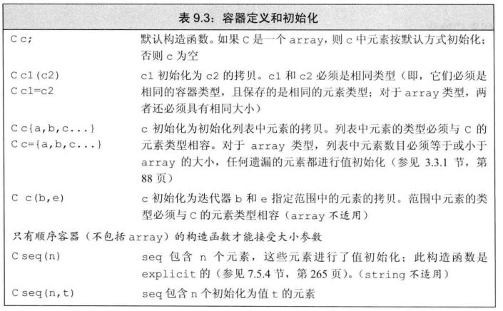

5. 赋值和`swap`操作
   - 除`aray`外，`swap`不对任何元素进行拷贝、删除或插入操作，因此可以保证在常数时间内完成。

    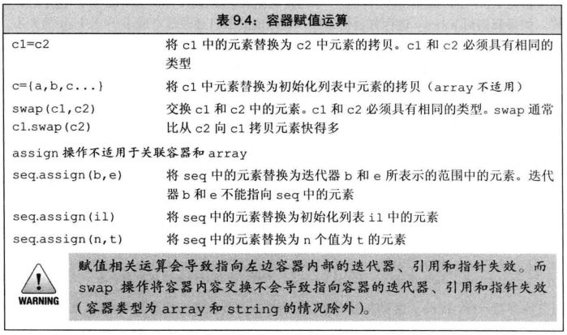

6. 容器大小操作：`size`, `empty`, `max_size`

7. 容器的关系运算符
   - 每个容器类型都支持相等运算符`=、!=`，除了无序关联容器外的所有容器都支持关系运算符`>、>=、<、<=`;
   - 容器的关系运算符使用元素的关系运算符完成比较，只有当其元素类型也定义了相应的比较运算符时，我们才可以使用关系运算符来比较两个容器；

## 8.3. 顺序容器操作

1. 向顺序容器添加元素
   - `push_back`：除`array`和`forward_list`外都支持；
   - `push_front`：`list`, `deque`, `forward_list`支持；
   - `insert`：在特定范围内插入元素；
   - `emplace`, `emplace_back`, `emplace_front`：在容器管理的内存空间中直接构造元素而不是拷贝元素。传给`emplace`函数的参数必须与元素类型的构造函数相匹配。

    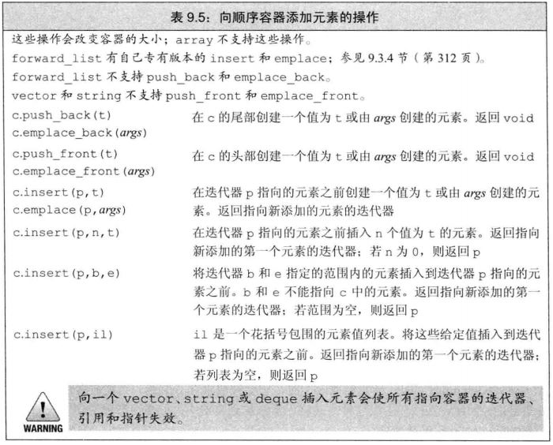

2. 访问元素：
   - `front`, `back`，返回的是引用；
   - 下标操作和安全的随机访问`at`（下标越界`at`会抛出异常`out_of_range`）；

    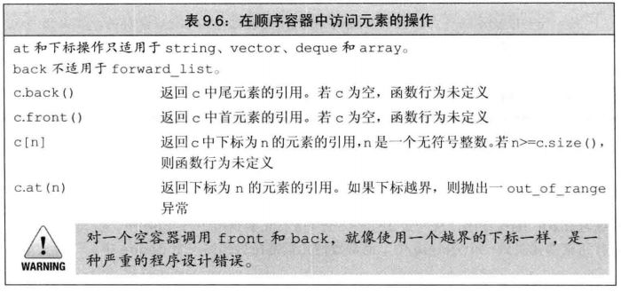

3. 删除元素：
   - `pop_back`, `pop_front`：函数返回空；
   - `erase`：在指定位置删除元素

    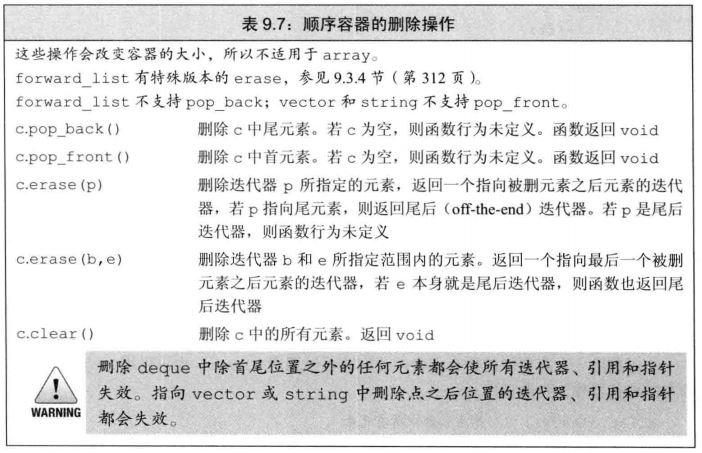

4. 特殊的`forward_list`操作:
   - `forward_1ist`是单向链表。在单向链表中，没有简单的方法来获取一个元素的前
   驱。因此，在一个`forward_1ist`中添加或删除元素的操作是通过改变给定元素之后的元素来完成的。

    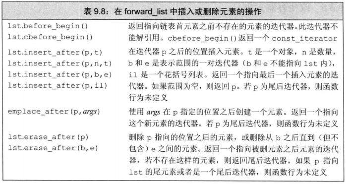

5. 改变容器的大小
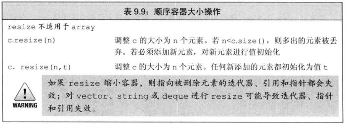

6. 容器操作可能使迭代器失效
   - 在向容器插入元素后:
     - 对于`vector`或`string`，且存储空间被重新分配，则指向容器的迭代器、指针和引用都会失效。如果存储空间未重新分配，指向插入位置之前的元素的迭代器、指针和引用仍有效，但指向插入位置之后元素的迭代器、指针和引用将会失效；
     - 对于`deque`，插入到除首尾位置之外的任何位置都会导致迭代器、指针和引用失效；如果在首尾位置添加元素，迭代器会失效，但指向存在的元素的引用和指针不会失效；
     - 对于`1ist`和`forward_1ist`，指向容器的迭代器(包括尾后迭代器和首前迭代器)、指针和引用仍有效；
   - 在向容器删除元素后：
     - 指向被删除元素的迭代器、指针和引用会失效；
     - 对于`1ist`和`forward_1ist`，指向容器其他位置的迭代器(包括尾后迭代器和首前迭代器)、引用和指针仍有效；
     - 对于`deque`，如果在首尾之外的任何位置删除元素，那么指向被删除元素外其他元素的送代器、引用或指针也会失效。如果是删除`deque`的尾元素，则尾后迭代器也会失；效,但其他迭代器、引用和指针不受影响;如果是删除首元素,这些也不会受影响；
     - 对于`vector`和`string`，指向被删元素之前元素的迭代器、引用和指针仍有效；
     - 注意：当我们删除元素时，尾后迭代器总是会失效。
   - 如果在一个循环中插入/删除`deque`、`string`或`vector`中的元素，不要缓存`end`返回的迭代器。

## 8.4. vector对象是如何增长的

1. 每个`vector`实现都可以选择自己的内存分配策略。但是必须遵守的一条原则是：只有当迫不得已时才可以分配新的内存空间。
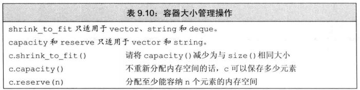

## 8.5. 额外的string操作

1. 构造函数

2. `substr`操作：`str.substr(pos, n)`

3. 改变`string`的其他方法:
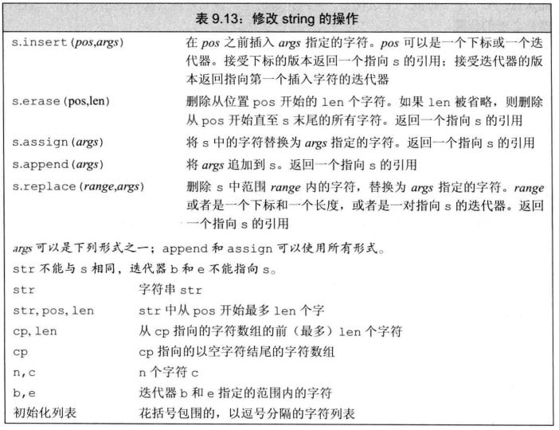

4. `string`的搜索操作：
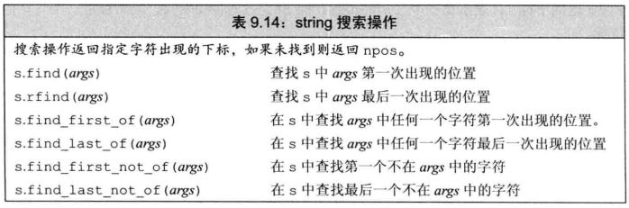
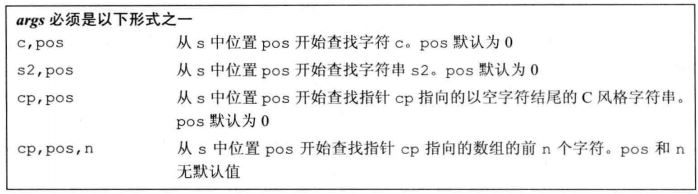

5. `compare`函数：
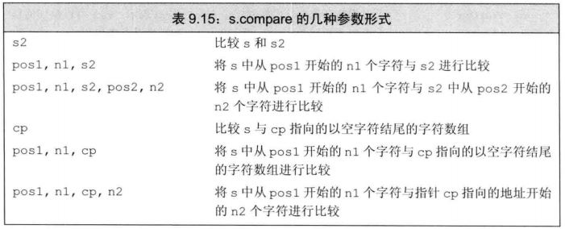

6. 数值转换：
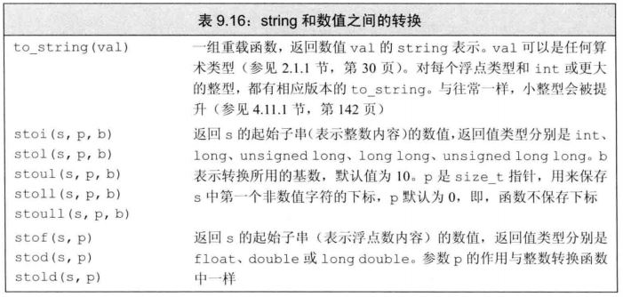

## 8.6. 容器适配器

1. 适配器(adaptor)是标准库中的一个通用概念。容器、迭代器和函数都有适配器。本质上，一个适配器是一种机制，能使某种事物的行为看起来像另外一种事物一样。一个容器适配器接受一种已有的容器类型，使其行为看起来像一种不同的类型。

2. 栈适配器和队列适配器：
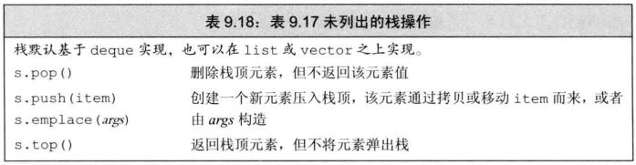
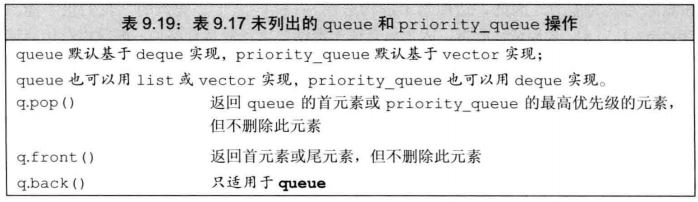
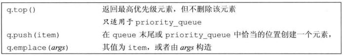

# 9. 泛型算法

## 9.1. 概述

1. 泛型算法(generic algorithm)：实现了一些经典算法的公共接口，如排序和搜索；可以用于不同类型的元素和多种容器类型(不仅包括标准库类型如`vector`或`1ist`，还包括内置的数组类型)。

## 9.2. 初识泛型算法

1. 只读算法：`find`, `accumulate`, `equal`...

2. 写容器算法：`fill`, `fill_n`...
   - `back_inserter`
   - 拷贝算法

3. 重排容器元素的算法：`sort`, `unique`...

4. 标准库算法对迭代器而不是容器进行操作。因此，算法不能(直接)添加或删除元素。

## 9.3. 定制操作

1. 向算法传递函数：
   - 谓词：一个可调用的表达式，其返回结果是一个能用作条件的值。标准库算法所使用的谓词分两类:一元谓词(unary predicate，只接受单一参数)和二元谓词(binary predicate，有两个参数)。接受谓词参数的算法对输入序列中的元素调用谓词。因此，元素类型必须能转换为谓词的参数类型。
   - `find_if`

2. `lambda`表达式：表示一个可调用的代码单元，可以将其理解为一个未命名的内联函数
   - 定义：`[capture list] (parameter list) -> return_type { function body }`；
   - 当定义一个`lambda`时，编译器生成一个与`lambda`对应的新的(未命名的)类类型；
   - 与函数不同，`lambda`表达式可能定义在函数内部，可以忽略参数列表和返回类型，但是一定要有捕获列表和函数体；
   - 如果`lambda`的函数体包含任何单一`return`语句之外的内容，且未指定返回类型，则返回`void`；
   - 一个`lambda`只有在其捕获列表中捕获一个它所在函数中的局部变量，才能在函数体中使用该变量；
   - 捕获列表只用于局部非`static`变量，`lambda`可以直接使用局部`static`变量和在它所在函数之外声明的名字；
   - 变量的捕获方式可以是值捕获或者引用捕获，还可以通过`&`或`=`告诉编译器进行隐式捕获，还可以混合捕获；
   - 可变`lambda`：`mutable`；

3. <font color=red>参数绑定：bind函数？？？</font>

## 9.4. 再探迭代器

1. 插入迭代器(insert iterator)：这些迭代器被绑定到一个容器上，可用来向容器插入元素

2. 流迭代器(stream iterator)：这些迭代器被绑定到输入或输出流上，可用来遍历所关联的IO流

3. 反向迭代器(reverse iterator)：这些迭代器向后而不是向前移动。除了`forward_1ist`之外的标准库容器都有反向迭代器

4. 移动迭代器(move iterator)：这些专用的送代器不是拷贝其中的元素，而是移动它们

## 9.5. 泛型算法结构

1. 5类迭代器：
   - 输入迭代器：只读，不写；单遍扫描，只能递增；
   - 输出迭代器：只写，不读；单遍扫描，只能递增；
   - 前向迭代器：可读写；多遍扫描，只能递增；
   - 双向迭代器：可读写；多遍扫描，可递增递减；
   - 随机访问迭代器：可读写；多遍扫描，支持全部迭代器运算；

2. 算法形参模式：

    ```cpp {class=line-numbers}
    alg(beg, end, other args);
    alg(beg, end, dest, other args);
    alg(beg, end, beg2, other args);
    alg(beg, end, beg2, end2, other args);
    ```

3. 算法命名规范：

## 9.6. 特定容器算法

1. `list`和`forward_list`成员函数版本的算法（可能会改变容器）
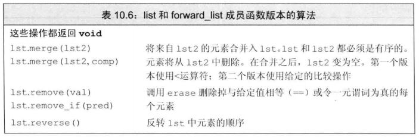
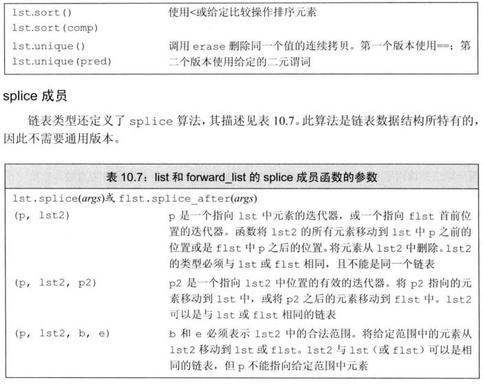

# 10. 关联容器

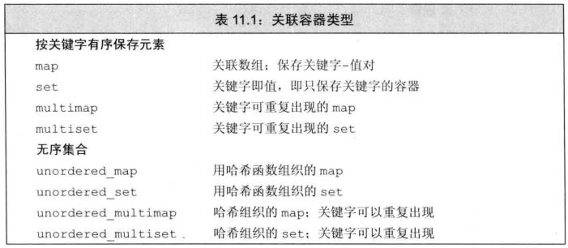

## 10.1. 使用关联容器

1. 使用`map`

    ```cpp {class=line-numbers}
    //统计每个单词在输入中出现的次数
    map<string, size_t> word_count;
    string word;
    while (cin >> word)
      ++word_count[word];
    for(const auto &w : word_count)
      cout << w.first << "occurs" << w.second << ((w.second > 1) ? "times" : "time") << endl
    ```

2. 使用`set`

    ```cpp {class=line-numbers}
    //统计输入中每个单词出现的次数
    map<string, size_t> word_count;
    set<string> exclude = {"The", "But", "And", " Or", "An", "but", "and", "or", "an"};
    string word;
    while (cin >> word)
      if (exclude.find(word) == exclude.end())
        ++word_count[word];
    ```

## 10.2. 关联容器概述

1. 有序关联容器中关键字类型的要求：
   - 关键字类型必须要定义元素比较的方法；
   - 在实际编程中，重要的是，如果一个类型定义了“行为正常”的`<`运算符，则它可以用作关键字类型;

2. `pair`类型：定义在头文件`<utility>`中，其数据成员`(first, second)`是`public`的

## 10.3. 关联容器操作

1. 关联容器额外的类型别名：
   - `key_type`：此容器类型的关键字类型；
   - `mapped_type`：每个关键字关联的类型，只适用于`map`；
   - `value_type`：对于`set`，与`key_type`相同；对于`map`，为`pair<const key_type, mapped_type>`；

2. 关联容器迭代器：
   - `set`的迭代器是`const`的；
   - 当使用一个选代器遍历一个`map、multimap、set、multiset`时，迭代器按关键字升序遍历元素；

3. 插入元素：
   - `c.insert(v)`：`v`是`value_type`类型的对象；
   - `c.emplace(args)`：对于`map`和`set`，只有当元素的关键字不在`c`中时才插入(或构造)元素。函数返回一个`pair`，包含一个迭代器，指向具有指定关键字的元素，以及一个指示插入是否成功的`boo1`值。对于`multimap`和`multiset`，总会插入(或构造)给定元素，并返回一个指向新元素的迭代器；
   - `c.insert(b, e)`和`c.insert(il)`：`b`和`e`是迭代器，表示一个`c::value_type`类型值的范围`i1`是这种值的花括号列表。函数返回`void`；对于`map`和`set`，只插入关键字不在`c`中的元素。对于`multimap`和`multiset`，则会插入范围中的每个元素；
   - `c.insert(p, v)`和`c.emplace(p, args)`：类似`insert(v)`或`emplace(args)`，但将迭代器`p`作为一个提示，指出从哪里开始搜索新元素应该存储的位置。返回一个迭代器，指向具有给定关键字的元素；

4. 删除元素：`c.erase(key), c.erase(ite), c.erase(ite1, ite2)`

5. `map`的下标操作：
   - `c[key]`：返回关键字为k的元素，如果k不在c中，添加一个关键字为k的元素，对其进行值初始化；
   - `c.at(key)`：访问关键字为k的元素，带参数检査，若k不在c中，抛出一个`out_of_range`异常；

6. 查询元素：
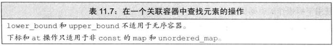
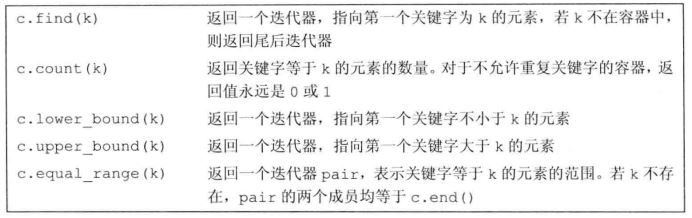

7. 在`multimap`或`multiset`中查找元素：重复关键字相邻存储

## 10.4. 无序容器

1. 无序容器对关键字类型的要求：
   - 默认情况下，无序容器使用关键字类型的`==`运算符来比较元素，它们还使用一个`hash<key_type>`类型的对象来生成每个元素的哈希值。标准库为内置类型(包括指针)提供了`hash`模板。还为一些标准库类型，包括`string`和智能指针类型定义了hash。因此,我们可以直接定义关键字是内置类型(包括指针类型)、`string`还是智能指针类型的无序容器；
   - 我们不能直接定义关键字类型为自定义类类型的无序容器。与容器不同，不能直接使用哈希模板，而必须提供我们自己的`hash`模板版本。

# 11. 动态内存

## 11.1. 动态内存和智能指针

1. 智能指针负责自动销毁所指向的对象，如果我们不初始化只能指针，则其被初始化为空指针。
   - `shared_ptr`允许多个指针指向同一个对象，使用引用计数的机制管理对象；
   - `unique_ptr`“独占”所指向的对象；
   - `weak_ptr`伴随类，是一种弱引用，指向`shared_ptr`所管理的对象；
   - 这三种类型都定义在`memory`头文件中。
2. `shared_ptr`模板类：
   - `make_shared`函数和`shared_ptr的`拷贝和賦值:
  
      ```cpp {class=line-numbers}
      shared_ptr<int> p1 = make_shared<int>();
      shared_ptr<int> p2 = make_shared<int>(42);
      shared_ptr<string> p3 = make_shared<string>(10, '9');
      auto p4 = make_shared<vector<string>>(),
      auto q(p1); //拷贝，引用计数加1
      q = p2; //赋值，q原来所指对象引用计数减1，p2所指对象引用计数加1
      ```

   - `shared_ptr的`自动销毁所管理的对象……
3. 程序使用动态内存出于以下三种原因之一：
   - 程序不知道自己需要使用多少对象。
   - 程序不知道所需对象的准确类型。
   - 程序需要在多个对象间共享数据。
4. 定位`new`运算符：`int *p1 = new (std::nothrow) int(0);`，当分配内存失败时，不抛出异常而是返回空指针
5. 使用`new`和`delete`管理动态内存存在三个常见问题：
   - 忘记`delete`内存。可能会导致“内存泄漏”。
   - 使用已经释放掉的对象。通过在释放内存后将指针置为空，有时可以检测出这种错误。
   - 同一块内存释放两次。当有两个指针指向相同的动态分配对象时，可能发生这种错误。
6. `shared_ptr`和`new`结合使用：用`new`返回的指针来初始化只能指针：

    ```cpp {class=line-numbers}
    shared_ptr<int> p1 = new int(1024); //错误:必须使用直接初始化形式
    shared_ptr<int> p2(new int(1024)); //正确:使用了直接初始化形式
    ```

7. 不要混合使用普通指针和智能指针：当将一个`shared_ptr`绑定到一个普通指针时，我们就将内存的管理责任交给了这个`shared_ptr`。一旦这样做了，我们就不应该再使用内置指针来访问`shared_ ptr`所指向的内存了，因为我们不知道智能指针何时会将对象销毁。
8. 不要使用`get`方法返回的普通指针来初始化另一个智能指针或为智能指针赋值，也不能`delete` `get()`返回的普通指针

    ```cpp {class=line-numbers}
    shared_ptr<int> p(new int(42); //引用计数为1
    int *q = p.get(); //正确:但使用q时要注意,不要让它管理的指针被释放
    {//新程序块
      shared_ptr<int>(q); //未定义:两个独立的shared_ptr指向相同的内存
    }//程序块结束,q被销毁,它指向的内存被释放
    int foo = *p;//未定义:p指向的内存已经被释放了
    ```

9. 智能指针和陷阱：智能指针可以提供对动态分配的内存安全而又方便的管理，但这建立在正确使用的前提下。为了正确使用智能指针，我们必须坚持一些基本规范：
   - 不使用相同的内置指针值初始化(或`reset`)多个智能指针；
   - 不`delete` `get()`返回的指针；
   - 不使用`get()`初始化或reset另一个智能指针；
   - 如果你使用get()返回的指针，记住当最后一个对应的智能指针销毁后，你的指针就变为无效了；
   - 如果你使用智能指针管理的资源不是new分配的内存，记住传递给它一个删除器。

10. `unique_ptr`：
    - 定义一个`unique_ptr`时，需要将其绑定到一个`new`返回的指针上。初始化`unique_ptr`必须采用直接初始化形式，且`unique_ptr`不支持普通的拷贝或赋值操作。

      ```cpp {class=line-numbers}
      unique_ptr<double> pl; //可以指向一个 double的 unique_ptr
      unique_ptr<int> p2(new int(42)); //p2指向一个值为42的int

      unique_ptr<string> pl(new string("Stegosaurus"));
      unique_ptr<string> p2(p1); //错误: unique_ptr不支持拷贝
      unique ptr<string> p3;
      p3 = p2 //错误: unique_ptr不支持赋值

      unique_ptr<string> p2(p1.release()); //将所有权从p1转移给p2，release将p1置为空
      unique_ptr<string> p3(new string("Trex"));
      p2.reset(p3.release()); //将所有权从p3转移给p2，reset释放了p2原来指向的内存
      ```

    - 不能拷贝`unique_ptr`的规则有一个例外：我们可以拷贝或赋值一个将要被销毁的`unique_ptr`。最常见的例子是从函数返回一个`unique_ptr`。
    - `auto_ptr`类：具有`unique_ptr`的部分特性，但不是全部。特别是,我们不能在容器中保存`auto_ptr`，也不能从函数中返回`auto_ptr`。
11. `weak_ptr`：不控制所指向对象生存期的智能指针，它指向由一个`shared_ptr`管理的对象，当创建一个`weak_ptr`时，要用一个`shared_ptr`来初始化它。将一个`weak_ptr`绑定到一个`shared_ptr`不会改变`shared_ptr`的引用计数。一旦最后一个指向对象的`shared_ptr`被销毁，对象就会被释放。

## 11.2. 动态数组

1. `new`和数组：分配一个动态数组会得到一个元素类型的指针，由于分配的内存并不是一个数组类型，因此不能对动态数组调用`begin`或`end`，也不能用范围`for`语句来处理(所谓的)动态数组中的元素。
2. 智能指针和动态数组：
   - `unique_ptr`可以直接管理动态数组；
   - `shared_ptr`需提供一个删除器才能管理动态数组，且不支持指针运算和下标运算符；

      ```cpp {class-line-numbers}
      unique_ptr<int[]> up(new int[10]); //up指向一个包含10个未初始化int的数组
      up.release(); //自动用 delete[]销毁其指针

      for (size_t i = 0 ; i != 10: ++i)
        (sp.get() + i) = i; // shared_ptr使用get获取一个内置指针
      ```

3. `allocator`模板类：定义在头文件`memory`中，将内存分配与对象构造分离。

## 11.3. 使用标准库：文本查询程序

# 12. 类设计者的工具

## 12.1. 拷贝、赋值与销毁

1. **拷贝构造函数：** 第一个参数是自身类型的**引用**，且任何额外参数都有默认值。
   - 编译器生成的默认拷贝构造函数；
   - 拷贝构造函数被隐式使用的情况；

    ```cpp {class=line-numbers}
    string dots(10, '.'); //直接初始化
    string s(dots); //直接初始化
    string s2 = dots; //拷贝初始化
    string null_book = "9-999-99999-9"; //拷贝初始化
    string nines = string(100, 97); //拷贝初始化
    ```

2. 拷贝初始化依靠拷贝构造函数或移动构造函数来完成，其发生的情况如下：
   - 用`=`定义变量时；
   - 将一个对象作为实参传递给一个非引用类型的形参；
   - 从一个返回类型为非引用类型的函数返回一个对象；
   - 用花括号列表初始化一个数组中的元素或一个聚合类中的成员；
   - 某些类类型会对它们分配的对象使用拷贝初始化。

3. **拷贝赋值运算符：** 通常返回一个指向其左侧运算对象的引用。
   - 拷贝赋值运算符本身是一个重载的赋值运算符，定义为类的成员函数，左侧运算对象绑定到隐含的this参数，而右侧运算对象是所属类类型的并作为函数的参数，函数返回指向其左侧运算对象的引用
   - 当对类对象进行赋值时，会使用拷贝赋值运算符；

4. **析构函数：** 不接受参数，不能被重载，一个类只有一个析构函数。
   - 在一个构造函数中，成员的初始化是在构造函数体执行之前完成的，且按照它们在类内出现的顺序进行初始化；
   - 在一个析构函数中，首先执行函数体，然后销毁成员，成员按初始化顺序的逆序销毁。
   - 析构函数体自身并不直接销毁成员，成员是在析构函数体之后隐含的析构阶段中被销毀的。在整个对象销毁过程中，析构函数体是作为成员销毁步骤之外的另一部分而进行的。

5. 深拷贝时，需要自定义拷贝构造函数、拷贝赋值运算符和析构函数。
6. 阻止拷贝：**[C++11]** 定义删除的函数，我们虽然声明了它，但不能以任何方式使用它们。
   - `=delete`必须出现在函数的第一次声明的时候；
   - 析构函数不能是删除的成员，但对于删除了析构函数的类型，虽然不能定义这种类型的变量或成员，但可以动态分配这种类型的对象。但是不能释放这些对象。
   - 如果一个类有数据成员不能默认构造、拷贝、复制或销毁，则该类对应的成员函数将被定义为删除的；本质上，当不可能拷贝、赋值或销毁类的成员时，类的合成拷贝控制成员就被定义为删除的。
   - 在新标准发布之前，类是通过将其拷贝构造函数和拷贝赋值运算符声明为`private`的来阻止拷贝；

## 12.2. 拷贝控制和资源管理

1. 深拷贝与浅拷贝：行为像值的类，意味着它应该也有自己的状态。当我们拷贝一个像值的对象时，副本和原对象是完全独立的。改变副本不会对原对象有任何影响，反之亦然；行为像指针的类则共享状态。当我们拷贝一个这种类的对象时，副本和原对象使用相同的底层数据。改变副本也会改变原对象，反之亦然。
2. 当编写一个赋值运算符时，一个好的模式是先将右侧运算对象持贝到一个局部临时对象中。当拷贝完成后，销毁左侧运算对象的现有成员就是安全的了。一旦左侧运算对象的资源被销毁，就只剩下将数据从临时对象拷贝到左侧运算对象的成员中了。（例：当将对象赋给自身时）
3. 引用计数：定义行为像指针的类
   - 除了初始化对象外，每个构造函数(拷贝构造函数除外)还要创建一个引用计数用来记录有多少对象与正在创建的对象共享状态。当我们创建一个对象时，只有个对象共享状态，因此将计数器初始化为1；
   - 拷贝构造函数不分配新的计数器，而是拷贝给定对象的数据成员，包括计数器。拷贝构造函数递增共享的计数器，指出给定对象的状态又被一个新用户所共享；
   - 析构函数递减计数器，指出共享状态的用户少了一个。如果计数器变为0，则析构函数释放状态；
   - 拷贝赋值运算符递增右侧运算对象的计数器,递减左侧运算对象的计数器。如果左侧运算对象的计数器变为0，意味着它的共享状态没有用户了，拷贝赋值运算符就必须销毀状态；
4. 引用计数器的实现方法：
   - 将计数器保存在动态内存中。当创建一个对象时，我们也分配一个新的计数器。当拷贝或赋值对象时,我们拷贝指向计数器的指针。使用这种方法，副本和原对象都会指向相同的计数器。

      ```cpp {class=line-numbers}
      class Hasptr
      {
      public:
        //构造函数分配新的string和新的计数器,将计数器置为1
        Hasptr(const std:string &s = std::string()) : 
        ps(new std::string(s)), i(0), use(new std::size_t(1)) { }
        
        //拷贝构造函数拷贝所有三个数据成员,并递增计数器
        Hasptr(const Hasptr &p) : ps(p.ps), i(p.i), use(p.use) { ++*use; }
        Hasptr &operator=(const Hasptr&);
        ~Hasptro();
      private:
        std::string *ps;
        int i;
        std::size_t *use;//用来记录有多少个对象共享*ps的成员
      }

      Hasptr::~Hasptr()
      {
        if(--*use == 0)
        {
          delete ps; //释放string内存
          delete use; //释放计数器内存
        }
      }

      Hasptr &Hasptr::operator=(const HasPtr &rhs)
      {
        ++*rhs.use; //递增右侧运算对象的引用计数
        if (--*use == 0)
        {
          delete ps
          delete use
        }
        ps = rhs.ps;
        i = rhs.i;
        use = rhs.use
        return *this:
      }
      ```

## 12.3. 交换操作

1. 如果一个类定义了自己的swap函数，那么算法将使用类自定义版本。否则，算法将使用标准库定义的swap。

2. 在赋值运算符里使用swap函数

## 12.4. 拷贝控制示例

## 12.5. 动态内存管理类

## 12.6. 对象移动

1. **[C++11]** “移动构造函数”和“移动赋值运算符”；
   - 函数参数为右值引用；
   - 不抛出异常，须标记为`noexcept`；
   - 只有当一个类没有定义任何自己版本的拷贝控制成员，且它的所有数据成员都能移动构造或移动赋值时，编译器才会为它合成移动构造函数或移动赋值运算符；
   - 定义了一个移动构造函数或移动赋值运算符的类必须也定义自己的拷贝操作否则，这些成员默认地被定义为删除的；

2. 标准库容器、`string`和`shared_ptr`类既支持移动也支持拷贝。IO类和`unique_ptr`类可以移动但不能拷贝。

3. **[C++11]** 右值引用`&&`，指向将要销毁的对象。

4. 变量是左值，因此我们不能将一个右值引用直接绑定到一个变量上，即使这个变量是右值引用类型也不行。

    ```cpp {class=line-numbers}
    int &&rr1 = 42; //正确:字面常量是右值
    int &&rr2 = rr1; //错误:表达式rr1是左值!
    ```

5. 标准库`move`函数：`int &&rr3 = std::move(rr1);` 我们可以销毁一个移后源对象，也可以赋予它新值，但不能使用一个移后源对象的值。在移动操作之后，移后源对象必须保持有效的、可析构的状态，但是用户不能对其值进行任何假设。

6. 右值引用和成员函数：区分移动和拷贝的重载函数通常有一个版本接受一个`const T&`，而另一个版本接受一个`T&&`版。因为对一个对象进行拷贝操作不应该改变对象，而移动操作则希望“窃取”右值的数据。

7. 使用引用限定符`&`、`&&`来限定对右值进行赋值。如果一个成员函数有引用限定符，则具有相同参数列表的所有版本都必须有引用限定符。

# 13. 操作重载与类型转换

## 13.1. 基本概念

1. 重载的运算符是具有特殊名字的函数：它们的名字由关键字`operator`和其后要定义的运算符号共同组成。

2. 某些运算符不应该被重载：例如`&&`和`||`运算符的重载版本无法保留内置运算符的短路求值属性，两个运算对象总是会被求值。

3. 将重载的运算符选择作为成员或者非成员函数：
   - 赋值`=`、下标`[]`、调用`()`和成员访问箭头`->`运算符必须是成员；
   - 复合赋值运算符一般来说应该是成员，但并非必须，这一点与赋值运算符略有不同；
   - 改变对象状态的运算符或者与给定类型密切相关的运算符，如递增、递减和解引用运算符，通常应该是成员；
   - 具有对称性的运算符可能转换任意一端的运算对象，例如算术、相等性、关系和位运算符等，因此它们通常应该是普通的非成员函数。

## 13.2. 输入和输出运算符

1. 输入输出运算符必须是非成员函数，一般声明为友元。

2. 通常，输出运算符应该主要负责打印对象的内容而非控制格式，重载输出运算符不应该打印换行符。

    ```cpp {class=line-numbers}
    ostream &operator<<(ostream &os, const Sales_data &item)
    {
      os << item.isbn() << " " << item.units_so1d;
      return os:
    }
    ```

3. 输入运算符必须处理输入可能失败的情况，此时输入运算符应该负责从错误中恢复：

    ```cpp {class=line-numbers}
    istream &operator>>(istream &is, Sales_data &item)
    {
      double price;
      is >> item.bookNo >> item.units_sold >> price;
      if (is) //检查输入是否成功
        item.revenue = item.units_sold * price
      else
        item = Sales_data(); //输入失败:对象被赋予默认的状态
      return 1s:
    }
    ```

## 13.3. 算术和关系运算符

1. 如果类同时定义了算术运算符和相关的复合赋值运算符，则通常情况下应该使用复合赋值来实现算术运算符。

    ```cpp {class=line-numbers}
    //假设两个对象指向同一本书
    Sales_data operator+(const Sales_data &lhs, const Sales_data &rhs)
    {
      Sales_data sum = lhs
      sum += rhs;
      return sum;
    }
    ```

2. `==`和`!=`运算符

3. 关系运算符`>`和`<`

## 13.4. 赋值运算符

1. 赋值运算符`=`：
   - 类除了可以定义拷贝赋值运算符外，还可以重载定义其它赋值运算符以使用别的类型作为右侧运算对象，比如花括号内的元素列表作为参数`std::initializer_list<type>`；
   - 和拷贝赋值及移动赋值运算符一样，其他重载的赋值运算符也必须先释放当前内存空间，再创建一片新空间；

2. 赋值运算苻必须定义成类的成员，复合赋值运算符通常情况下也应该这样做。这两类运算符都应该返回左侧运算对象的引用。

## 13.5. 下标运算符

1. 下标运算符通常以所访问元素的引用作为返回值，这样做的好处是下标可以出现在赋值运算符的任意一端。进一步，我们最好同时定义下标运算符的常量版本和非常量版本，当作用于一个常量对象时，下标运算符返回常量引用以确保我们不会给返回的对象赋值。

## 13.6. 递增和递减运算符

1. 定义递增和递减运算符的类应该同时定义前置版本和后置版本。这些运算符通常应该被定义成类的成员。

2. 为了与内置版本保持一致，前置运算符应该返回递增或递减后对象的引用，后置运算符应该返回对象的原值(递增或递减之前的值)，返回的形式是一个值而非引用。

3. 为了区分前置版本和后置版本，后置版本接受一个额外的不被使用的`int`类型的形参。在后置版本中可以复用前置版本函数进行递增或递减操作。

4. 在迭代器中定义递增或递减操作时，需要检查操作后的有效性。

## 13.7. 成员访问运算符

## 13.8. 函数调用运算符

## 13.9. 重载、类型转换与运算符

1. 类型转换运算符：`operator type() const`
   - 一个类型转换函数必须是类的成员函数，它不能声明返回类型，形参列表也必须为空。类型转换西数通常应该是`const`；
   - 类型转换运算符是隐式执行的；
   - 在实践中,类很少提供类型转换运算符。在大多数情況下，如果类型转换自动发生，用户可能会感觉比较意外，而不是感觉受到了帮助。但是对于类来说，定义向boo1的类型转换还是比较普遍的现象。

2. 如果在调用重载函数时我们需要使用构造函数或者强制类型转换来改变实参的类型，则这通常意味着程序的设计存在不足。

# 14. 面向对象程序设计

## 14.1. OOP：概述

1. OOP的核心思想是数据抽象（封装）、继承、动态绑定（多态）。

2. 继承：`public`、`protected`、`private`。

3. 虚函数：对于某些函数，基类希望它的派生类各自定义适合自身的版本，此时基类就将这些函数声明成虚函数`virtual`。

4. 在C++语言中，当我们使用基类的引用（或指针）调用一个虚函数时将发生动态绑定（多态）。

## 14.2. 定义基类和派生类

1. 基类通常都应该定义一个虚析构函数，即使该函数不执行任何实际操作也是如此。

2. 任何构造函数之外的非静态函数都可以是虚函数。关键字`virtua1`只能出现在类内部的声明语句之前而不能用于类外部的函数定义。如果基类把一个函数声明成虚函数，则该函数在派生类中隐式地也是虚函数。派生类可以在它覆盖的函数前使用`virtua1`关键字，但不是非得这么做。C++11新标准允许派生类显式地注明它使用某个成员函数覆盖了它继承的虚函数。具体做法是在形参列表后面、或者在`const`成员函数的`const`关键字后面、或者在引用成员函数的引用限定符后面添加一个关键字`override`。

3. 每个类控制它自己的成员初始化过程。派生类通过调用基类的构造函数首先初始化基类的部分，然后按照声明的顺序依次初始化派生类的成员。

4. 继承与静态成员：如果基类定义了一个静态成员，则在整个继承体系中只存在该成员的唯一定义。不论从基类中派生出来多少个派生类，对于每个静态成员来说都只存在唯一的实例。

5. **[C++11]** 防止继承的发生，在声明类名的后面加关键字`final`。

6. 不允许将派生类指针或引用绑定到基类对象上。之所以存在派生类向基类的类型转换是因为每个派生类对象都包含一个基类部分，而基类的引用或指针可以绑定到该派生类对象的基类部分上。

7. 当我们用一个派生类对象为一个基类对象初始化或赋值时，只有该派生类对象中的基类部分会被拷贝、移动或赋值，它的派生类部分将被忽略摔。

## 14.3. 虚函数

1. 所有虚函数都必须有定义。通常情况下，如果我们不使用某个函数，则无须为该函数提供定义，但是我们必须为每一个虚函数都提供定义，而不管它是否被用到了，这是因为连编译器也无法确定到底会使用哪个虚函数。

2. 基类中的虚函数在派生类中隐含地也是一个虚函数。当派生类覆盖了某个虛函数时，该函数在基类中的形参必须与派生类中的形参严格匹配。

3. `final`和`override`说明符；

4. 如果虚函数使用默认实参，则基类和派生类中定义的默认实参最好一致。因为默认实参值由本次调用的静态类型决定。

5. 回避虚函数的机制：类作用域运算符。

## 14.4. 抽象基类

1. 纯虚函数：无须定义，在声明语句的分号之前书写`=0`。也可以为纯虚函数提供定义，不过函数体必须定义在类的外部。

2. 含有纯虚函数的类是抽象基类，我们不能创建抽象基类的对象。

## 14.5. 访问控制与继承

1. 类成员的访问说明符：`protected`成员：
   - 对于类的用户来说是不可访问的；
   - 派生类的成员和友元可以且只能通过派生类对象访问派生类对象中的基类部分的受保护成员。派生类对于一个基类对象中的受保护成员没有任何的访问特权；
   - 和其他类一样，基类应该将其接口成员声明为公有的，同时将属于其实现的部分分成两组：一组可供派生类访问，另一组只能由基类及基类的友元访问。对于前者应该声受保护的，这样派生类就能在实现自己的功能时使用基类的这些操作和数据，对于后者应该声明为私有的。

2. 继承的访问说明符：
   - 派生访问说明符对于派生类的成员(及友元)能否访问其直接基类的成员没什么影响。派生类对于基类的访问权限只与基类中的访问说明符有关。
   - 派生访问说明符的目的是控制派生类用户(包括派生类的派生类在内)对于基类成员的访问权限。

3. 友元和继承：
   - 不能继承友元关系；
   - 每个类负责控制各自成员的访问权限；

4. 可以使用`using`声明来改变派生类继承自基类的成员的可访问性，但派生类只能为那些它可以访问的基类成员提供`using`声明。

5. `struct`关键字和`c1ass`关键字定义的类之间唯一的差别就是默认成员访问说明符及默认派生访问说明符。`struct`默认是`public`的，`class`默认是`private`的。

## 14.6. 继承中的类作用域

1. 除了覆盖继承而来的库函数之外，派生类最好不要重用其他定义在基类中的名字。

2. 名字查找优先于类型检查。

3. 声明在内层作用域的函数不会重载声明在外层作用域的函数，因此定义派生类中的函数也不会重载其基类中的成员。如果派生类(即内层作用域)的成员与基类(即外层作用域)的某个成员同名，则派生类将在其作用域内隐藏该基类成员。即使派生类成员和基类成员的形参列表不一致，基类成员也仍然会被隐藏掉。

```cpp {class=line-numbers}
class Base
{
public:
  virtual int fcn();
};

class Dl : public Base
{
public:
  // D1继承了Base:fcn()的定义
  int fcn(int); //隐藏基类的fcn，这个fcn不是虚函数
  virtual void f2(); //是一个新的虚函数,在Base中不存在
};

class D2 : public Dl
{
public:
  int fcn(int); //是一个非虚函数，隐藏了D1::fcn(int)
  int fcn(); //虚函数，覆盖了Base的虚函数fcn
  void f2(); //虚函数，覆盖了D1的虚函数f2
};

Base bobj; Dl dlob1; D2 d2obj;
Base *bpl = &bobj, *bp2 = &d1obj, *bp3 = &d2obj;
bpl->fcn(); //虚调用,将在运行时调用Base::fcn
bp2->fcn(); //虚调用,将在运行时调用Base:fc
bp3->fcn(); //虚调用,将在运行时调用D2::fcn

Dl *d1p = &dlobj; D2 *d2p = &d2obj; 
bp2->f2(); //错误:Base没有名为f2的成员
d1p->f2(); //虚调用,将在运行时调用D1::f2()
d2p->f2(); //虚调用,将在运行时调用D2::f2()
```

## 14.7. 构造函数和拷贝控制

1. 虚析构函数：如果基类的析构函数不是虚函数，则`delete`一个指向派生类对象的基类指针将产生未定义的行为。

2. 虚析构函数将阻止合成移动操作；

3. 合成拷贝控制与继承：
   - 派生类中删除的拷贝控制与基类的关系；
   - 移动操作与继承；

4. 派生类的拷贝控制成员：
   - 派生类构造函数不但要初始化派生类自己的成员，还负责初始化派生类对象的基类部分。因此，派生类的拷贝和移动构造函数在拷贝和移动自有成员的同时，也要拷贝和移动基类部分的成员。类似的,派生类赋值运算符也必须为其基类部分的成员赋值；
   - 派生类的析构函数只负责销毁派生类自己分配的资源，对象的成员是被隐式销毁的；类似的，派生类对象的基类部分也是自动销毁的；

      ```cpp {class= line-numbers}
      class D: public Base 
      {
      public:
        //Base::~Base被自动调用执行
        ~D() { /* 该处由用户定义清除派生类成员的操作 */}
      }
      ```

   - 当派生类定义了赋值、拷贝或移动操作时，该操作负责赋值、拷贝或移动包括基类部分成员在内的整个对象。

      ```cpp {class=line-numbers}
      class Base {/* ... */};
      class D : public Base
      {
      public:
        //默认情况下,基类的默认构造函数初始化对象的基类部分
        //要想使用拷贝或移动构造函数,我们必须在构造函数初始值列表中显式地调用该构造函教
        D(const D &d) : Base(d) //拷贝基类成员 /* D的成员的初始值 */ 
        {/* .... */}
        D(D &&d) : Base(std::move(d)) //移动基类成员 /* D的成员的初始值 */ 
        {/* .... */}

        D &D::operator=(const D &rhs); //为派生类重载赋值运算符
      };

      D &D::operator=(const D &rhs)
      {
        Base::operator=(rhs); //为基类部分赋值
        //接照过去的方式为派生类的成员赋值
        //酌情处理自赋值及释放已有资源等情况
        return *this:
      }
      ```

5. <font color=red>在构造函数和析构函数中调用虚函数？？？</font>

6. <font color=red>继承的构造函数？？？</font>

## 14.8. 容器与继承

# 15. 模板与泛型编程

面向对象编程(OOP)和泛型编程都能处理在编写程序时不知道类型的情况。不同处在于：OOP能处理类型在程序运行之前都未知的情况；而在泛型编程中，在编译时就能获知类型了。

## 15.1. 定义模板

## 15.2. 模板实参推断

## 15.3. 重载与模板

## 15.4. 可变参数模板

## 15.5. 模板特例化

# 16. 标准库特殊设施

# 17. 用于大型程序的工具

# 18. 特殊工具和技术
