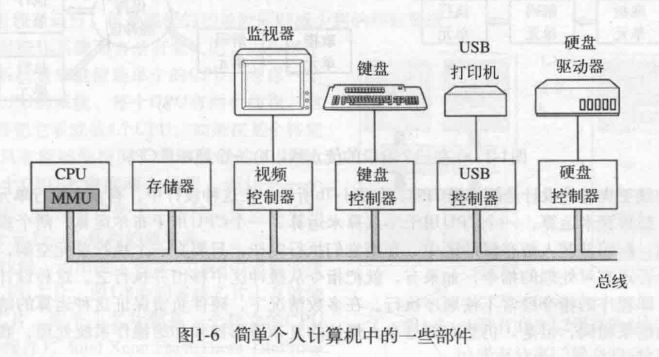
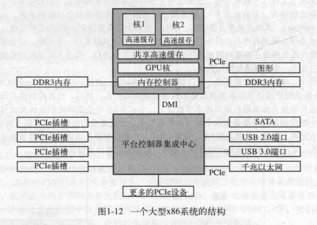
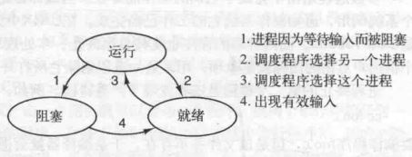
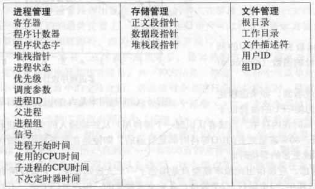

# 《现代操作系统 第4版》阅读笔记

## 第1章 引论

### 1.1 什么是操作系统

1. 操作系统的两大作用：
   - 自顶向下（从应用层的角度看）：为应用程序提供对硬件资源的清晰抽象，比如说将CPU的使用抽象成进程的管理，虚拟内存的抽象，将硬盘抽象为文件，I/O操作的抽象；
   - 自底向上（从底层硬件的角度看）：管理复杂的硬件资源，比如为多进程分配CPU、内存等资源；

2. 内核态与用户态：
   - 当程序在内核态运行时，CPU拥有对硬件的完全访问权，可以执行指令集中的毎一条指令；
   - 当程序在用户态运行时，CPU仅允许访问所有硬件功能的一个子集和执行整个指令集的一个子集。比如，在用户态中有关I/O和内存保护的所有指令是禁止的，其必须通过系统调用才能进行I/O访问；

3. 用户接口程序：shell和GUI

### 1.2 操作系统的历史

1. 第一代(1945~1955):真空管和穿孔卡片

2. 第二代(1955~1965):晶体管和批处理系统

3. 第三代(1965~1980):集成电路和多道程序设计

4. 第四代(1980年至今):个人计算机

5. 第五代(1990年至今):移动计算机

### 1.3 计算机硬件简介

1. 处理器:
   - CPU与指令集。
   - 程序计数器（PC）：将要执行的下一条指令的内存地址。
   - 堆栈指针：指向内存中当前栈的顶端。该栈包含了每个执行过程的栈帧。一个过程的栈帧中保存了有关的输入参数、局部变量以及那些没有保存在寄存器中的临时变量。
   - 程序状态字(Program Status Word, PSW)寄存器。这个寄存器包含了条件码位(由比较指令设置)、CPU优先级、模式(用户态或内核态)，以及各种其他控制位。用户程序通常读入整个PSW，但是只对其中的少量字段写入。在系统调用和IO中，PSW的作用很重要。
   - 流水线、超标量CPU。
   - 内核态、用户态、系统调用。
   - 多线程与多核芯片。

2. 存储器：层次结构，寄存器、高速缓存、主存、磁盘

3. 磁盘：
   - 虚拟内存机制，使得期望运行大于物理内存的程序成为可能，其方法是将程序放在磁盘上，而将主存作为一种缓存，用来保存最频繁使用的部分程序。这种机制需要快速地映像内存地址，以便把程序生成的地址转换为有关字节在RAM中的物理地址。这种映像由CPU中的一个称为存储器管理单元(Memory Management Unit, MMU)的部件来完成。

4. I/O设备（设备控制器和设备本身）：实现输入和输出的方式
   - **系统调用：** 用户程序发出一个系统调用，内核将其翻译成对应设备驱动程序的过程调用；
   - **中断：** 设备驱动程序启动设备并且让该设备在操作完成时发出一个中断；
   - **DMA：** 直接存储器访问(Direct Memory Access, DMA)芯片，它可以控制在内存和某些控制器之间的位流，而无须持续的CPU干预。

5. 总线：
   - 共享总线架构：多个设备使用一些相同的导线传输数据；
   - 并行总线架构：表示通过多条导线发送数据的每一个字。例如，在传统的PCI总线上，一个32位数据通过32条并行的导线发送。
   - 串行总线架构：通过一条被称为数据通路的链路传递集合了所有位的一条消息，这非常像网络包。例如，PCIe；

    
    

6. 启动计算机：
   - BIOS开始运行，它首先检査所安装的RAM数量，键盘和其他基本设备是否已安装并正常响应。接着，它开始扫描PCIe和PCI总线并找出连在上面的所有设备。即插即用设备也被记录下来。如果现有的设备和系统上一次启动时的设备不同，则新的设备将被配置；
   - BIOS通过尝试存储在CMOS存储器中的设备清单决定启动设备；
   - 操作系统询问BIOS，以获得配置信息。

### 1.4 操作系统大观园

1. 大型机操作系统

2. 服务器操作系统

3. 多处理器操作系统

4. 个人计算机操作系统

5. 掌上计算机操作系统

6. 嵌入式操作系统

7. 传感器节点操作系统

8. 实时操作系统

9. 智能卡操作系统

### 1.5 操作系统概念

1. **进程：**
   - 进程本质上是正在执行的一个程序；

2. **地址空间：**
   - 在本质上，操作系统创建了一个地址空间的抽象，作为进程可以引用地址的集合。该地址空间与机器的物理内存解耦，可能大于也可能小于该物理空间；

3. 文件

4. I/O

5. 保护

6. shell

### 1.6 系统调用

1. 进程管理、文件管理、目录和文件系统管理、POSIX标准

### 1.7 操作系统结构

1. 单体系统：在大多数常见的组织中，整个操作系统在内核态以单一程序的方式运行。整个操作系统以过程集合的方式编写，链接成一个大型可执行二进制程序。
   - 需要一个主程序，用来处理服务过程请求；
   - 需要一套服务过程，用来执行系统调用；
   - 需要一套实用过程，用来辅助服务过程；

2. 层次式系统

3. 微内核

4. 客户端服务器模式

5. 虚拟机、JVM虚拟机、外核

### 1.8 依靠C的世界

1. 预处理、编译、链接、运行

## 第2章 进程与线程

### 2.1 进程

1. **进程模型：**
   - 进程是对正在运行程序的一个抽象。一个进程就是一个正在执行程序的实例，包括程序计数器、寄存器和变量的当前值。

2. **进程的创建：**
   - 4种主要事件会导致进程的创建:
     - 系统初始化：守护进程等；
     - 正在运行的程序执行了创建进程的系统调用；
     - 用户请求创建一个新进程；
     - 一个批处理作业的初始化；
   - POSIX进程创建：`fork`

3. **进程的终止：**
   - 进程终止的条件：
     - 正常退出(自愿的)；
     - 出错退出(自愿的)；
     - 严重错误(非自愿)；
     - 被其他进程杀死(非自愿)。

4. **进程的层次结构：**
   - 在UNIX中，进程和它的所有子进程以及后裔共同组成一个进程组；
   - 在Windows中没有进程层次的概念，所有的进程都是地位相同的。唯一类似于进程层次的暗示是在创建进程的时候，父进程得到一个特别的令牌(称为句柄)，该句柄可以用来控制子进程。但是它有权把这个令牌传送给某个其他进程,这样就不存在进程层次了；

5. **进程的状态：**
   - 三态模型：运行、就绪、阻塞

6. **进程的实现：**
   - 进程表（进程控制块）：结构体数组
   - 典型的进程表表项中的一些字段

7. 多道程序设计模型：

### 2.2 线程

1. **线程的使用的原因：**
   - 多线程拥有并共享同一个地址空间和所有可用数据的能力；
   - 线程比进程更加轻量，可以更快地进行创建、删除和切换；
   - 多线程有助于处理存在大量IO和大量计算的活动，允许这些活动彼此重叠地进行，加快程序执行速度（输入线程、处理线程、输出线程）；
   - 有助于多CPU系统中实现真正的并行；

2. **经典的线程模型：**
   - 每个进程仅有一个单独的控制线程或每个进程中含有多个独立的线程；
   - 线程之间是没有保护的：同一个进程中的所有线程都有完全一样的地址空间，它们共享同样的全局变量。由于各个线程都可以访问进程地址空间中的每一个内存地址，所以一个线程可以读、写或甚至清除另一个线程的堆栈；
   - PCB和TCB的区别：

3. **POSIX线程：**

    线程调用 | 描述
    :------ | :--
    pthread_create | 创建一个新线程
    phread_exit | 结束调用的线程
    pthread_join | 等待一个特定的线程退出
    pthread_yield | 释放CPU来运行另外一个线程
    pthread_attr_init | 创建并初始化一个线程的属性结构
    pthread_attr_destroy | 删除一个线程的属性结构

4. **在用户空间实现线程（每个进程管理自己的线程表）：**
   - 优点：
     - 可以在不支持线程的操作系统上实现，使用函数库实现线程；
     - 线程切换时不需要陷入内核，不需要上下文切换，使得线程调度非常快捷；
     - 允许每个进程定制自己的调度算法；
   - 缺点：
     - 如何实现阻塞系统调用？
     - 如果一个进程内的线程开始运行，则该进程内的其他线程就不能运行；

5. **在内核中实现线程（内核统一管理线程表）：**
   - 优点：
     - 一个线程阻塞时，内核根据其选择，可以运行同一个进程中的另一个线程(若有一个就绪线程)或者行另一个进程中的线程。而在用户级线程中，运行时系统始终运行自己进程中的线程，直到内核剥夺它的CPU(或者没有可运行的线程存在了)为止。
   - 缺点：
     - 所有能够阻塞线程的调用都以系统调用的形式实现，这与运行时系统过程相比，代价是相当可观的；
     - 开销大；

6. 混合实现：

### 2.3 进程间通信（IPC）

1. **竞争条件：**
   - 两个或多个进程读写某些共享数据，而最后的结果取决于进程运行的精确时序，称为竞争条件；
   - 例子：两个共享资源A和B，进程1持有资源A并加锁且申请资源B，进程2持有资源B并加锁且申请资源A；

2. **临界区：**
   - 把对共享内存进行访问的程序片段称作临界区域或临界区；

3. **忙等待的互斥：**
   - 定义：
     - 连续测试一个变量直到某个值出现为止，称为忙等待。用于忙等待的锁称为自旋锁。忙等待的本质为：当一个进程想进入临界区时，先检查是否允许进入，若不允许，则该进程将原地等待，直到允许为止。这种方法不仅浪费了CPU时间，而且还可能引起预想不到的结果。
   - 实现方法：
     - 屏蔽中断：每个进程进入临界区时屏蔽所有中断，离开临界区时打开中断；但是不适合于用户进程；
     - 锁变量；
     - 严格轮换法；
     - Peterson解法；
     - TSL指令：测试并加锁；

4. **信号量：**
   - `down; up`操作；

5. **互斥量和条件变量：**
   - 互斥量是一个可以处于两态之一的变量：加锁和解锁；
   - 条件变量允许线程由于一些未达到的条件而阻塞；
   - `pthread`中的互斥量和条件变量；

    线程调用 | 描述
    :---  | :--
    pthread_mutex_init | 创建一个互斥量
    pthread_mutex_destroy | 撤销一个已存在的互斥量
    pthread_mutex_lock | 获得一个锁或阻塞
    pthread_mutex_trylock | 获得一个锁或失败
    pthread_mutex_unlock | 释放一个锁

    线程调用 | 描述
    :---   | :--
    pthread_cond_init | 创建一个条件变量
    pthread_cond_destroy | 撤销一个条件变量
    pthread_cond_wait | 阻塞以等待一个信号，和互斥量结合使用，可解锁互斥量
    pthread_cond_signal | 向另一个线程发信号来唤醒它
    pthread_cond_broadcast | 向多个线程发信号来让它们全部唤醒

6. **避免锁：**
   - 读-复制-更新（最快的锁就是没有锁）

7. **生产者-消费者问题（有界缓冲区问题）：**
    - 定义：两个进程共享一个公共的固定大小的缓冲区。其中一个是生产者，将信息放入缓冲区；另一个是消费者，从缓冲区中取出信息。
    - 使用信号量解决生产者-消费者问题；
    - 使用互斥量和条件变量解决生产者-消费者问题；

8. **Linux系统中的IPC机制**
    - 父进程通过`fork`可以将打开文件的描述符传递给子进程；
    - 子进程结束时，父进程调用`wait`可以得到子进程的终止信息；
    - 几个进程可以在文件系统中读写某个共享文件，也可以通过给文件加锁来实现进程间同步；
    - 进程之间互发信号，一般使用SIGUSR1和SIGUSR2实现用户自定义功能；
    - 管道：`pipe`系统调用；
    - FIFO文件；
    - `mmap`函数，几个进程可以映射同一内存区；
    - SYS V IPC，以前的SYS V UNIX系统实现的IPC机制，包括消息队列、信号量和共享内存，现在已经基本废弃
    - UNIX Domain Socket，目前最广泛使用的IPC机制

9. **进程间通信的机制：**
   - 管道：
   - 信号：
   - 信号量：
   - 消息队列：
   - 共享内存：
   - Socket套接字：

10. **线程间同步的方式：**
    - 锁机制：包括互斥锁/量、读写锁、自旋锁、条件变量
      - 互斥锁/量：提供了以排他方式防止数据结构被并发修改的方法；
      - 读写锁：允许多个线程同时读共享数据，而对写操作是互斥的；
      - 自旋锁：与互斥锁类似，都是为了保护共享资源。互斥锁是当资源被占用，申请者进入睡眠状态；而自旋锁则循环检测保持者是否已经释放锁。
      - 条件变量：可以以原子的方式阻塞进程，直到某个特定条件为真为止。对条件的测试是在互斥锁的保护下进行的。条件变量始终与互斥锁一起使用。
    - 信号量机制(Semaphore)：

11. **进程与线程的区别：**
    - 进程是操作系统进行资源分配的最小单位，线程是操作系统进行CPU调度的最小单位；
    - 线程是轻量级的进程，相对于进程，线程的创建、删除和切换具有更快的速度；
    - 多进程之间具有独立的地址空间；同一进程内的多个线程共享同一地址空间，但是具有独立的寄存器、堆栈和程序计数器；

12. **死锁**
    - 概念：多进程由于竞争资源而产生的一种阻塞现象，若无外力作用，则它们都无法继续执行下去；
    - 产生死锁的4个必要条件：
      - 互斥：进程要求对所分配的资源进行排它性控制，即在一段时间内某资源仅为一进程所占用；
      - 占有且等待：当进程因请求资源而阻塞时，对已获得的资源保持不放；
      - 不可抢占：进程已获得的资源在未使用完之前，不能剥夺，只能在使用完时由自己释放；
      - 循环等待：在发生死锁时，必然存在一个进程--资源的环形链；
    - 处理死锁的方法：
      - 死锁预防：
        - 资源一次性分配（破坏占有且等待条件）；
        - 可抢占资源，即当某进程获得了部分资源，但得不到其它资源，则释放已占有的资源（破坏不可抢占条件）
        - 资源有序分配法，系统给每类资源赋予一个编号，每一个进程按编号递增的顺序请求资源，释放则相反（破坏循环条件）
      - 死锁避免：
        - 预防死锁是设法至少破坏产生死锁的四个必要条件之一，严格地防止死锁的出现，但是这也会使系统性能降低；而避免死锁则不那么严格的限制产生死锁的必要条件的存在，因为即使死锁的必要条件存在，也不一定发生死锁，死锁避免是在系统运行过程中注意避免死锁的最终发生；
        - 银行家算法
      - 死锁检测：
      - 死锁解除：

### 2.4 调度

1. 调度简介：
   - 进程行为：计算密集型与IO密集型；
   - 何时调度：
     - 父进程创建子进程时，选择父进程还是子进程运行？
     - 一个运行的进程正常退出时；
     - 一个运行的进程被阻塞时；
     - 发生IO中断时；
   - 调度算法的目标：
     - 所有系统
       - 公平：给每个进程公平的CPU份额；
       - 策路强制执行：保证规定的策略被执行
       - 平衡：保持系统的所有部分都忙碌
     - 批处理系统
       - 吞吐量：每小时最大作业数
       - 周转时间：从提交到终止间的最小时间
       - CPU利用率：保持CPU始终忙碌
     - 交互式系统
       - 响应时间：快速响应请求
       - 均衡性：满足用户的期望
     - 实时系统
       - 满足截止时间：避免丢失数据
       - 顸测性：在多媒体系统中避免品质降低

2. 批处理系统中的调度：
   - 先来先服务；
   - 最短作业优先；
   - 最短剩余时间优先；

3. 交互式系统中的调度：
   - 轮转调度；
   - 优先级调度；
   - 多级队列；
   - 最短进程优先；
   - 保证调度；
   - 彩票调度；
   - 公平分享调度；

4. 实时系统中的调度：

5. 策略和机制：

6. 线程调度

### 2.5 经典的IPC问题

1. 哲学家就餐问题

2. 读者-写者问题

### 2.6 有关进程与线程的研究

### 2.7 小结

## 第3章 内存管理

### 3.1 无存储器抽象

### 3.2 一种存储器抽象：地址空间

1. 地址空间的概念：
   - 地址空间是一个进程可用于寻址内存的一套地址集合；
   - 每个进程的地址空间独立于其他进程的地址空间，除了某些特殊情况下进程需要共享他们的地址空间除外；

2. 如何使得每个进程拥有相同的地址集合，但是却能寻址到不同的物理地址？
   - 基址寄存器与界限寄存器：
     - 存储程序在物理内存内的起始地址和程序的长度；
     - 缺点：每次访问内存都要进行加法和比较运算，在没有使用特殊电路的情况下会显得很慢；

3. 处理内存超载的方法：
   - 交换技术：把一个进程完整地调入内存，使该进程运行一段时间，然后把它存回磁盘；
   - 虚拟内存：可以使进程在只有一部分调入内存的情况下运行；

4. 交换技术带来的问题：
   - 内存空洞，可以使用内存紧缩技术来将小的空闲区合成一大块；
   - 动态内存分配，需要为进程的增长预留空间，当预留空间也不足时需要将进程移动到足够大的空闲区；

5. 空闲区内存管理：
   - 位图：
     - 内存被划分成小到几个字节或大到几千字节的分配单元，每个分配单元对应于位图中的一位，1代表已分配，0代表空闲；
     - 分配单元越小，位图越大；
     - 当把一个占k个分配单元的进程调入内存时，存储管理器需要在位图中搜索出k个连续0的串，这是比较耗时的操作；
   - 空闲区链表：
     - 链表的每个节点包含的数据域为：空闲或已分配标志，起始地址和长度；
     - 当进程终止或被换出内存时，可能需要合并空闲区；
     - 当在链表中查询合适的空闲区用于调入内存时，可以使用以下算法：
       - 首次适配：在链表中找到第一个合适的节点；
       - 下次适配：记录上次找到的节点，下次从该节点之后开始搜索；
       - 最佳适配：遍历找到最合适（空闲区大小和进程所需大小相近）的一个节点，会产生大量无用的小空闲区；
       - 最差适配：遍历找到最大空闲区进行分配，使得新的空闲区比较大而可以继续使用；
       - 快速适配：

### 3.3 虚拟内存

- 物理内存是真实存在的内存，其容量是有限的；
- 虚拟内存是为了解决物理内存超载而提出的一种技术，其基本思想是：
  - 每个进程拥有自己的虚拟地址空间，这个空间被均匀地分割成许多块，每一块称作一页或页面；
  - 每一页有连续的地址范围，这些页被映射到物理内存，每个进程只需要有部分页面被装载在物理内存内就可以运行；
  - 当进程引用到一部分不在物理内存中的页面时，由操作系统执行缺页中断将缺失的页面置换到物理内存并重新执行失败的指令。在此期间操作系统可以将CPU分配给其他进程运行。

1. 分页（如何将虚拟地址映射到物理地址）：
   - 页框：物理内存地址空间划分单元；
   - 页面：虚拟地址空间划分单元；
   - 页表：将虚拟页面映射到页框；
     - 页框号
     - 在/不在物理内存中标志位；
     - 保护位：读、写、执行权限；
     - 修改位（脏位）：若被修改，则需更新其在磁盘上的副本；
     - 访问位：用于执行页面置换算法；
     - 高速缓存禁止位：用于禁止高速缓存，保证其直接从IO设备读取数据；
   - MMU将虚拟地址映射为物理地址的机制：
     - 虚拟地址被分成虚拟页号（高位部分）和偏移量（低位部分），可通过虚拟页号找到页表中该虚拟地址所在页面对应的页表项；
     - 由该页表项可以找到该页面对应的页框号，然后用页框号替换掉虚拟地址中高位部分的虚拟页号并保留低位部分的偏移量，就可以形成物理地址；

2. TLB（快表）：加速虚拟地址到物理地址的转换过程
   - 问题：每次访问数据，都需要先到内存中访问页表
   - 解决：设置小型的硬件设备TLB，其包含少量的页表项（虚拟页号、页框号等）
     - 在进行虚拟地址到物理地址的转换时，硬件首先通过虚拟页号与TLB中的表项同时（并行）进行匹配，判断该虚拟页面是否在其中；
     - 如果发现了一个有效的匹配并且要进行的访问操作并不违反保护位，则将页框号直接从TLB中取出而不必再访问页表。如果虚拟页号确实是在TLB中，但指令试图在一个只读页面上进行写操作，则会产生一个保护错误，就像对页表进行非法访问一样；
     - 如果检测到没有有效的匹配项，就会进行正常的页表查询。接着从TLB中淘汰一个表项，然后用新找到的页表项代替它。这样，如果这一页面很快被再次访问则第二次访问TLB时自然将会命中而不是未命中；
     - 当一个表项被清除出TLB时，将修改位复制到内存中的页表项，而除了访问位，其他的值不変。当页表项从页表中装入TLB中时，所有的值都来自内存。

3. 解决页表过大问题；
   - 多级页表：
     - 避免把全部页表一直保存在内存中；
   - 倒排页表：
     - 每一个页框对应一个页表项而不是每一个虚拟页面对应一个页表项；
     - 页表项中记录了哪一个（进程、虚拟页面）对对应于该页框；
     - 问题：每次都需要搜索整个页表找到对应的页框；
       - TLB失效时，可通过哈希（用虚拟地址作为散列）来搜索整个倒排页表；

### 3.4 页面置换算法

1. 最优页面置换算法
   - 算法：在缺页中断发生时，在内存中的每个页面用在该页面首次被访问前所要执行的指令数作为标记，最优页面置换算法规定应该置换标记最大的页面；
   - 优点：可作为其他页面置换算法的比较；
   - 缺点：无法实现，仅针对特定的指令和数据；

2. 最近未使用页面置换算法（NRU）
   - 可以用访问位（R位）和修改位（M位）来构造一个简单的页面置换算法：当启动一个进程时，它的所有页面的两个位都由操作系统设置成0，R位被定期地（比如在每次时钟中断时）清零，以区别最近没有被访问的页面和被访问的页面；
   - 当发生缺页中断时，操作系统检査所有的页面并根据它们当前的R位和M位的值，把它们分为4类：
     - 第0类：没有被访问，没有被修改；
     - 第1类：没有被访问，已被修改；
     - 第2类：已被访问，没有被修改；
     - 第3类：已被访问，已被修改；
   - NRU(Not Recently Used，最近未使用)算法随机地从类编号最小的非空类中挑选一个页面淘汰。这个算法隐含的意思是，在最近一个时钟滴答中(典型的时间是大约20ms)淘汰一个没有被访问的已修改页面要比淘态一个被频繁使用的“干净”页面好。
   - 优点：易于理解和能够有效地被实现；
   - 缺点：性能不是最好的；

3. 先进先出页面置换算法（FIFO）
   - 算法：由操作系统维护一个所有当前在内存中的页面的链式队列，最新进入的页面放在表尾，最早进入的页面放在表头。当发生缺页中断时，淘汰表头的页面并把新调入的页面加到表尾；
   - 优点：简单；
   - 缺点：可能淘汰频繁使用的页面；

4. 第二次机会页面置换算法
   - 算法：对FIFO算法进行改进，检査最老页面的R位。如果R位是0，那么这个页面既老又没有被使用，可以立刻置换掉；如果是1，就将R位清0，并把该页面放到链表的尾端，修改它的装入时间使它就像刚装入的一样，然后继续搜索；
   - 优点：相较于FIFO算法有较大改进；
   - 缺点：但经常需要链表中移动页面，既降低了效率又不必要；

5. 时钟页面置换算法
   - 算法：把所有的页面都保存在一个类似钟面的环形链表中，一个表针指向最老的页面。当发生缺页中断时，算法首先检査表针指向的页面，如果它的R位是0就淘汰该页面，并把新的页面插入这个位置，然后把表针前移一个位置；如果R位是1就清除R位并把表针前移一个位置。重复这个过程直到找到了一个R位为0的页面为止。
   - 优点：不用移动链表的节点；
   - 缺点：

6. 最近最少使用页面置换算法（LRU）
   - 算法：当发生缺页中断时，置换未使用时间最长的页面；

7. 软件模拟LRU（NFU，最不常用）

8. 老化算法

9. 工作集页面置换算法

10. 工作集时钟页面置换算法

11. 页面置换算法小结

### 3.5 分页系统中的设计问题

### 3.6 有关实现的问题

### 3.7 分段

## 第4章 文件系统

## 第5章 输入/输出
