- [1. 计算机网络和因特网](#1-计算机网络和因特网)
  - [1.1. 什么是因特网](#11-什么是因特网)
  - [1.2. 网络边缘](#12-网络边缘)
  - [1.3. 网络核心](#13-网络核心)
  - [1.4. 分组交换网中的时延、丢包和吞吐量](#14-分组交换网中的时延丢包和吞吐量)
  - [1.5. 协议层次及其服务模型](#15-协议层次及其服务模型)
  - [1.6. 面对攻击的网络](#16-面对攻击的网络)
  - [1.7. 计算机网络和因特网的历史](#17-计算机网络和因特网的历史)
  - [1.8. 小结](#18-小结)
- [2. 第2章 应用层](#2-第2章-应用层)
  - [2.1. 应用层协议原理](#21-应用层协议原理)
  - [2.2. HTTP(HyperText Transfer Protocol，超文本传输协议)和Web](#22-httphypertext-transfer-protocol超文本传输协议和web)
  - [2.3. SMTP和因特网中的电子邮件](#23-smtp和因特网中的电子邮件)
  - [2.4. DNS(Domain Name System)：因特网的目录服务](#24-dnsdomain-name-system因特网的目录服务)
  - [2.5. P2P文件分发](#25-p2p文件分发)
  - [2.6. 视频流和内容分发网](#26-视频流和内容分发网)
  - [2.7. 套接字编程：生成网络的应用](#27-套接字编程生成网络的应用)
  - [2.8. 其他](#28-其他)
- [3. 第3章 运输层](#3-第3章-运输层)
  - [3.1. 概述和运输层服务](#31-概述和运输层服务)
  - [3.2. 运输层的多路复用和多路分解](#32-运输层的多路复用和多路分解)
  - [3.3. 无连接传输：UDP](#33-无连接传输udp)
  - [3.4. 可靠数据传输原理](#34-可靠数据传输原理)
  - [3.5. 面向连接的传输：TCP](#35-面向连接的传输tcp)
  - [3.6. 拥塞控制原理](#36-拥塞控制原理)
  - [3.7. TCP拥塞控制](#37-tcp拥塞控制)
  - [3.8. TCP和UDP的区别](#38-tcp和udp的区别)
- [4. 网络层：数据平面](#4-网络层数据平面)
  - [4.1. 网络层概述](#41-网络层概述)
  - [4.2. 路由器工作原理](#42-路由器工作原理)
  - [4.3. 网际协议：IPv4、寻址、IPv6](#43-网际协议ipv4寻址ipv6)
  - [4.4. 通用转发和SDN](#44-通用转发和sdn)
- [5. 网络层：控制平面](#5-网络层控制平面)
  - [5.1. 概述](#51-概述)
  - [5.2. 路由选择算法](#52-路由选择算法)
  - [5.3. 因特网中自治系统内部的路由选择：OSPF](#53-因特网中自治系统内部的路由选择ospf)
  - [5.4. ISP之间的路由选择：BGP](#54-isp之间的路由选择bgp)
  - [5.5. SDN控制平面](#55-sdn控制平面)
  - [5.6. ICMP：因特网控制报文协议](#56-icmp因特网控制报文协议)
  - [5.7. 网络管理和SNMP](#57-网络管理和snmp)
- [6. 链路层和局域网](#6-链路层和局域网)

# 1. 计算机网络和因特网

## 1.1. 什么是因特网

1. 从构成因特网的基本硬件和软件组件描述因特网的具体构成：
   - 主机（端系统）；
   - 通信链路（有线、无线）、分组交换机（路由器、链路层交换机）；
   - ISP（因特网服务提供商）、协议；
2. 从为分布式应用提供服务的联网基础设施来描述因特网：
   - 套接字接口：规定了运行在一个端系统上的程序请求因特网基础设施向运行在另一个端系统上的特定目的地程序交付数据的方式，是一套发送程序必须遵循的规则集合。
3. 协议(protocol)定义了在两个或多个通信实体之间交換的报文的格式和顺序，以及报文发送和/或接收一条报文或其他事件所采取的动作。

## 1.2. 网络边缘

1. 接入网：指将端系统物理连接到其边缘路由器(edge router)的网络。边缘路由器是端系统到任何其他远程端系统的路径上的第一台路由器。
   - 家庭接人:DSL、电缆、FTTH、拨号和卫星；
   - 企业(和家庭)接人：以太网和WiFi；
   - 广域无线接人：3G和LTE；
2. 物理媒体：双绞铜线、同轴电缆、光纤、无线信道。

## 1.3. 网络核心

1. 分组交换：
   - 存储转发传输与传输时延；
   - 排队时延和分组丢失；发送链路忙时产生排队时延，分组交换机的输出缓存队列满时发生丢包；
   - 转发表和路由选择协议：

2. 电路交换：在电路交换网络中，在端系统间通信会话期间，预留了端系统间沿路径通信所需要的资源(缓存，链路传输速率)。

3. <font color=red>分组交换和电路交换的比较：</font>

    对比的方面 | 虚电路服务 | 数据报服务
    :---|:----|:---
    思路 | 可靠通信应当由网络来保证 | 可靠通信应当由用户主机来保证
    连接的建立 | 必须有 | 不需要
    终点地址 | 仅在连接建立阶段使用，每个分组使用短的虚电路号 | 每个分组都有终点的完整地址
    分组的转发 | 属于同一条虚电路的分组均按照同一路由进行转发 | 每个分组独立选择路由进行转发
    当结点出故障时 | 所有通过出故障的结点的虚电路均不能工作 | 出故障的结点可能会丢失分组，一些由可能会发生变化
    分组的顺序 | 总是按发送顺序/到达终点 | 到达终点的时间不一定按发送顺序
    端到端的差错处理和流量控制 | 可以由网络负责，也可以由用户主机负责 | 由用户主机负责

4. 网络中的网络

## 1.4. 分组交换网中的时延、丢包和吞吐量

1. 分组交换网中的时延：
   - 处理时延：检査分组首部和决定将该分组导向、检查比特级别的差错等。微秒或更低的数量级；
   - 排队时延：取决于网络拥塞程度；
   - 传输时延：毫秒到微妙量级；
   - 传播时延：在广域网中，传播时延为毫秒量级；
2. 排队时延和丢包；
3. 计算机网络中的吞吐量；

## 1.5. 协议层次及其服务模型

1. 分层的体系结构：结构化、只要定义了良好的层间接口就可以使得一层的变化不易影响到其它层的变化；但是分层可能带来一层冗余了较低层功能的缺点
   - 应用层：HTTP、SMTP、FTP、DNS，报文（message）；
   - 表示层：使通信的应用程序能够解释交换数据的含义。这些服务包括数据压缩和数据加密(它们是自解释的)以及数据描述(这使得应用程序不必担心在各台计算机中表示存储的内部格式不同的问题)；
   - 会话层：会话层提供了数据交换的定界和同步功能，包括了建立检査点和恢复方案的方法；
   - 运输层：TCP（有拥塞控制）、UDP（无拥塞控制），报文段（segment）；
   - 网络层：IP、路由选择协议，数据报（datagram）；
   - 链路层：帧（frame）；
   - 物理层：比特（bits）；
2. 因特网缺少了在OSI参考模型中建立的两个层次，如果一个应用程序需要这些服务之一，这留给应用程序开发者处理。应用程序开发者决定一个服务是否是重要的，如果该服务重要，应用程序开发者就应该在应用程序中构建该能。

## 1.6. 面对攻击的网络

## 1.7. 计算机网络和因特网的历史

## 1.8. 小结

# 2. 第2章 应用层

## 2.1. 应用层协议原理

1. 应用程序的体系结构：客户端-服务器体系结构、对等（P2P）体系结构。
   - 客户端-服务器结构：Web、FTP、Telnet和电子邮件
     - 总是有一个打开的主机，服务来自多个客户端的请求；
     - 客户相互之间不通信；
     - 服务器具有固定的、周知的地址；
   - P2P结构：迅雷
     - 对于数据中心的专用服务器有最小的（或者没有）依赖；
     - 应用程序在间断连接的主机对之间使用直接通信；
2. 进程（应用程序）与计算机网络之间的接口：套接字（应用程序编程接口）；
3. 进程寻址（跨越主机）：IP地址+端口号，web服务器进程80、邮件服务器进程25。
4. 因特网提供的运输服务：TCP（面向连接、可靠数据传输、拥塞控制、无安全保护）、UDP（无连接、不可靠、无拥塞控制、无安全保护）。
5. 应用层协议：定义了运行在不同端系统上的应用程序进程如何相互传递报文。应用层协议定义了:
   - 交换的报文类型，例如请求报文和响应报文；
   - 各种报文类型的语法，如报文中的各个字段及这些字段是如何描述的；
   - 字段的语义，即这些字段中的信息的含义；
   - 确定一个进程何时以及如何发送报文，对报文进行响应的规则；

    应用 | 应用层协议 | 支撑的运输层协议
    :-:|:-:|:-:
    电子邮件 | SMTP | TCP
    远程终端访问 | Telnet | TCP
    Web | HTTP | TCP
    文件传输 | FTP | TCP
    流式多媒体 | HTTP | TCP
    因特网电话 | SIP | UDP

## 2.2. HTTP(HyperText Transfer Protocol，超文本传输协议)和Web

1. HTTP是一个无状态协议，因为HTTP服务器并不保存关于客户的任何信息。
2. URL（Uniform Resource Locator，统一资源定位符）是因特网上标准的资源的地址（Address）：
   - 组成：资源类型、存放资源的主机域名、资源文件名。也可认为由4部分组成：协议、主机、端口、路径；
   - 语法格式：`protocol://[username:password@]hostname[:port]/path/[;parameters][?query]#fragment`，其中`[]`内的为可选项；
   - 例子：
     - `https://baike.baidu.com/item/URL格式/10056474?fr=aladdin`
     - `file:///E:/02_研究生/就业求职/Markdown-Note/C++Primer-Note.md`
3. Web页面由对象组成，一个对象可以是HTML文件、一张图片、一个小程序或其它。通常情况下，Web页面由一个HTML基本文件+其它对象组成，HTML文件通过对象的URL地址（主机名+对象路径名）引用页面的其它对象。
4. HTTP的非持续连接和持续连接：
   - 非持续连接：每个请求/响应对是经过一个单独的TCP连接发送的；
   - 持续连接：所有的请求/响应对是经过一个相同的TCP连接发送的；
   - 请求并接收一个HTTP文件所需的时间：一个RTT用于创建TCP连接，另一个RTT用于进行HTTP请求/响应，如下图所示
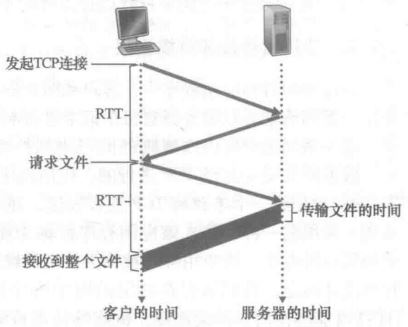

5. HTTP报文格式：
   - HTTP请求报文：请求行、首部行、实体体

      ```html {class=line-numbers}
      Get /somedir/page.html HTTP/1.1 //请求行：方法、对象URL、HTTP版本
      Host: www.someschool.edu //首部行：指明对象所在主机
      Connection: close //首部行：浏览器告诉服务器发送完被请求的对象后就关闭TCP连接
      User-agent: Mozilla/5.0 //首部行：向服务器发送请求的浏览器的类型
      Accept-language: fr //首部行：用户想得到的对象的语言版本
      ```

      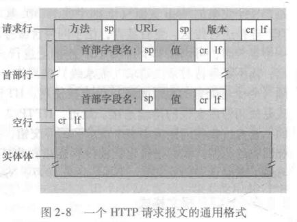
   - 请求方法
      方法 | 意义
      :--: | :--
      OPTIONS | 请求一些选项信息，允许客户端查看服务器的性能
      GET | 请求指定的页面信息，并返回实体主体
      HEAD | 类似于 get 请求，只不过返回的响应中没有具体的内容，用于获取报头
      POST | 向指定资源提交数据进行处理请求（例如提交表单或者上传文件）。数据被包含在请求体中。POST请求可能会导致新的资源的建立和/或已有资源的修改
      PUT | 从客户端向服务器传送的数据取代指定的文档的内容
      DELETE | 请求服务器删除指定的页面
      TRACE | 回显服务器收到的请求，主要用于测试或诊断

   - HTTP响应报文：状态初始行、首部行和实体体

      ```html {class=line-numbers}
      HTTP/1.1 200 OK //状态行：版本、状态码、相应的状态信息
      Connection: close //首部行：服务器告诉浏览器发送完报文后关闭TCP连接
      Date: Tue, 18 Aug 2015 15:44:04 GMT //首部行：将被请求对象插入响应报文的时间
      Server: Apache/2.2.3 (Centos) //首部行：服务器类型
      Last-modified: Tue, 18 Aug 2015 15:11:03 GMT //首部行：被请求对象创建或最后修改时间
      Content-length: 6821 //首部行：被请求对象的字节数
      Content-type: text/html //首部行：被请求对象类型
      (data data data data data ...) //实体体：被请求对象本身
      ```

      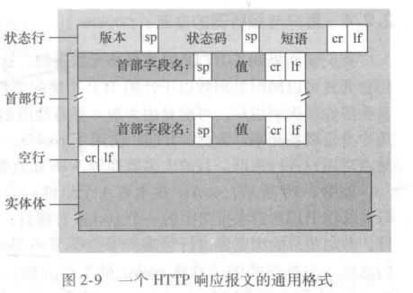

   - 状态码（Status-Code）
     - 1xx：表示通知信息，如请求收到了或正在进行处理
       - 100 Continue：继续，客户端应继续其请求
       - 101 Switching Protocols 切换协议。服务器根据客户端的请求切换协议。只能切换到更高级的协议，例如，切换到 HTTP 的新版本协议
     - 2xx：表示成功，如接收或知道了
       - 200 OK: 请求成功
     - 3xx：表示重定向，如要完成请求还必须采取进一步的行动
       - 301 Moved Permanently: 永久移动。请求的资源已被永久的移动到新 URL，返回信息会包括新的 URL，浏览器会自动定向到新 URL。今后任何新的请求都应使用新的 URL 代替
     - 4xx：表示客户的差错，如请求中有错误的语法或不能完成
       - 400 Bad Request: 客户端请求的语法错误，服务器无法理解
       - 401 Unauthorized: 请求要求用户的身份认证
       - 403 Forbidden: 服务器理解请求客户端的请求，但是拒绝执行此请求（权限不够）
       - 404 Not Found: 服务器无法根据客户端的请求找到资源（网页）。通过此代码，网站设计人员可设置 “您所请求的资源无法找到” 的个性页面
       - 408 Request Timeout: 服务器等待客户端发送的请求时间过长，超时
     - 5xx：表示服务器的差错，如服务器失效无法完成请求
       - 500 Internal Server Error: 服务器内部错误，无法完成请求
       - 503 Service Unavailable: 由于超载或系统维护，服务器暂时的无法处理客户端的请求。延时的长度可包含在服务器的 Retry-After 头信息中
       - 504 Gateway Timeout: 充当网关或代理的服务器，未及时从远端服务器获取请求

6. 用户和服务器的交互：cookie
   - HTTP服务器是无状态的，不能识别不同的用户；
   - HTTP通过cookie来识别用户并对用户的行为进行跟踪；
   - cookie技术的4个组件：
     - 在HTTP响应报文中的一个cookie首部行；
     - 在HTTP请求报文中的一个cookie首部行；
     - 在用户端系统中保留有一个cookie文件，并由用户的测览器进行管理；
     - 位于Web站点的一个后端数据库；

      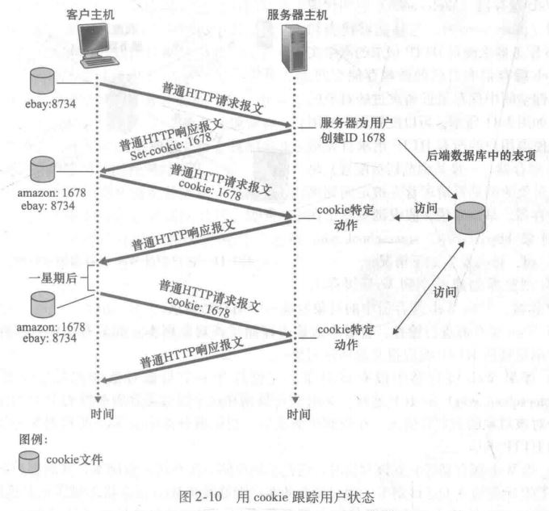

7. Web缓存器（代理服务器），可以减少用户感受到的响应时间，但是会带来缓存副本是否是最新的问题。
8. 条件get方法：允许缓存器证明它的对象是最新。如果请求报文使用GET方法并且请求报文中包含一个“If-Modified-Since:”首部行，那么,这个HTTP请求报文就是一个条件GET请求报文。

## 2.3. SMTP和因特网中的电子邮件

1. 因特网电子邮件的三个主要组成部分：用户代理、邮件服务器和简单邮件传输协议：
   - 用户代理(user agent)：允许用户阅读、回复、转发、保存和撰写报文；
   - 邮件服务器(mail server)：待发送的邮件存放在外出报文队列，接收的邮件放在邮箱
   - 简单邮件传输协议(Simple Mail Transfer Protocol, SMTP)
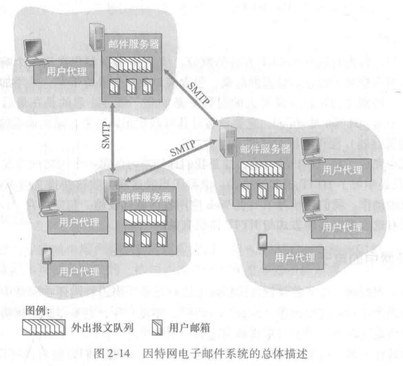

2. SMTP协议（25号端口）
   - SMTP的基本命令：`HELO(HELO的缩写)、MAIL FROM、RCPT TO、DATA、QUIT` 等
    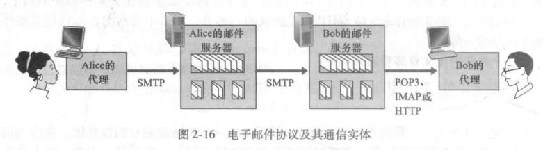
   - 邮件报文格式：

    ```html {class=line-numbers}
    //一个典型的报文首部看起来如下:
    From: alice@crepes.fr
    To: bob@hamburger.edu
    Subject: Searching for the meaning of life
    ```

   - 邮件访问协议：POP3、IMAP、HTTP。
3. SMTP和HTTP的区别：
   - SMTP是一个push协议，即发送邮件服务器把文件推向一个接收邮件服务器；HTTP是一个pull协议，即在方便的时候，某些用户在Web服务器装载信息，用户从Web服务器拉取所需信息；
   - SMTP要求每个报文(包括它们的体)采用7比特ASCII码格式。如果某报文包含了非7比特ASCII字符或二进制数据(如图形文件)，则该报文必须按照7比特ASCII码进行编码。HTP数据则不受这种限制；
   - SMTP则把所有报文对象放在一个报文之中，HTTP把每个对象封装到它自己的HTTP响应报文中。
4. 基于Web的电子邮件：用户代理为Web浏览器，用户代理和邮件服务器之间通过HTTP协议进行通信。

## 2.4. DNS(Domain Name System)：因特网的目录服务

1. DNS是：一个由分层的DNS服务器实现的分布式数据库；一个使得主机能够査询分布式数据库的应用层协议。DNS服务器通常是运行BIND(Berkeley Internet Name Domain)软件的UNIX机器。
2. DNS使用UDP，端口53。当前，对于每一级域名长度的限制是63个字符，域名总长度则不能超过253个字符。`域名 ::= {<三级域名>.<二级域名>.<顶级域名>}`，如：`blog.huihut.com`
3. DNS提供从主机名到IP地址转换的服务，还提供：
   - 主机别名：
   - 邮件服务器别名：
   - 负载分配：
4. DNS工作机理概述：
   - 分布式、层次数据库：根、顶级域（TLD）、权威DNS服务器；
   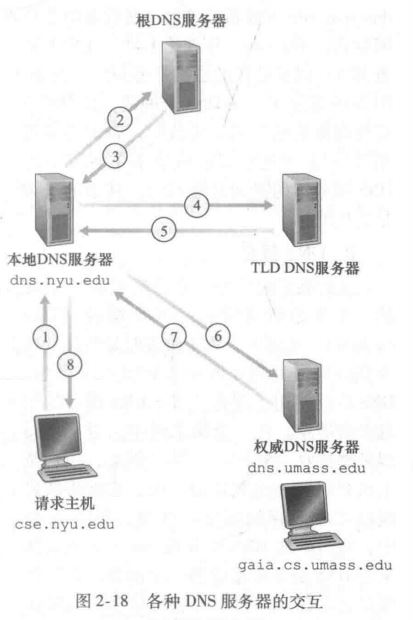
   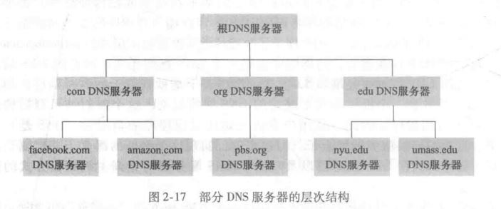
   - DNS缓存：为了减少查询的次数，可在某次查询完成后缓存查询的主机名/IP地址映射，并设定丢弃时间。事实上，因为缓存，除了少数DNS查询以外，根服务器被绕过。
5. DNS记录和报文：
   - 资源记录(Resource Record, RR)：`(Name, Value, Type, TTL)`
     - `TTL`：决定RR应当从缓存中删除的时间；
     - `Name`和`Value`取决于`Type`的值；
       - 如果`Type=A`，则`Name`是主机名，`Value`是该主机名对应的P地址；
       - 如果`Type=NS`，则`Name`是个域，如：`(foo、com)`，而`Value`是个知道如何获得该域中主机IP地址的权威DNS服务器的主机名。这个记录用于沿着查询链来路由DNS査询；
       - 如果`Type=CNAME`，则`Value`是别名为`Name`的主机对应的规范主机名。该记录能够向查询的主机提供一个主机名对应的规范主机名；
       - 如果`Type=MX`，则`Value`是个别名为`Name`的邮件服务器的规范主机名。`MX`记录允许邮件服务器主机名具有简单的别名。值得注意的是，通过使用MX记录，一个公司的邮件服务器和其他服务器(如它的Web服务器)可以使用相同的别名。为了获得邮件服务器的规范主机名，DNS客户应当请求一条MX记录；而为了获得其他服务器的规范主机名，DNS客户应当请求`CNAME`记录。
   - DNS报文：查询和回答报文有着相同的格式
   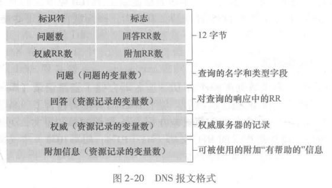

## 2.5. P2P文件分发

## 2.6. 视频流和内容分发网

## 2.7. 套接字编程：生成网络的应用

## 2.8. 其他

1. FTP（File Transfer Protocol，文件传输协议）是用于在网络上进行文件传输的一套标准协议，使用客户/服务器模式，使用 TCP 数据报，提供交互式访问，双向传输。

2. TFTP（Trivial File Transfer Protocol，简单文件传输协议）一个小且易实现的文件传输协议，也使用客户-服务器方式，使用UDP数据报，只支持文件传输而不支持交互，没有列目录，不能对用户进行身份鉴定。

3. TELNET 协议是 TCP/IP 协议族中的一员，是 Internet 远程登陆服务的标准协议和主要方式。它为用户提供了在本地计算机上完成远程主机工作的能力。

# 3. 第3章 运输层

## 3.1. 概述和运输层服务

1. 运输层和网络层的关系：网络层提供了主机之间的逻辑通信，而运输层为运行在不同主机上的进程之间提供了逻辑通信。

2. UDP和TCP最基本的责任是：将两个端系统间IP的交付服务扩展为运行在端系统上的两个进程之间的交付服务。将主机间交付扩展到进程间交付被称为运输层的多路复用与多路分解。

## 3.2. 运输层的多路复用和多路分解

1. 无连接的多路复用和多路分解：
   - UDP套接字端口号的分配方式：通常，应用程序的客户端让运输层自动地（并且是透明地）分配端口号，而服务器端则分配一个特定的端口号。

      ```python {class=line-numbers}
      clientSocket = socket(AF_INET, SOCK_DGRAM) # 自动分配一个未使用的UDP端口号
      clientSocket.bind(('', 19157)) # 关联特定端口号
      ```

   - UDP套接字是由一个二元组全面标识的，该二元组包含一个目的IP地址和一个目的端口号。因此,如果两个UDP报文段有不同的源IP地址和/或源端口号，但具有相同的目的IP地址和目的端口号，那么这两个报文段将通过相同的目的套接字被定向到相同的目的进程。
   - 源端口号用作“返回地址”的一部分，即当B需要回发一个报文段给A时，B到A的报文段中的目的端口号便从A到B的报文段中的源端口号中取值。

2. 面向连接的多路复用和多路分解：
   - TCP套接字是由一个四元组（源IP地址，源端口号，目的IP地址，目的端口号）来标识的。

## 3.3. 无连接传输：UDP

1. UDP相对于TCP的几个特点：
   - 关于发送什么数据以及何时发送的应用层控制更为精细；
   - 无须建立连接；
   - 无连接状态，不同维护拥塞控制等相关状态参数；
   - 分组首部开销小；
2. UDP报文段格式：源端口号、目的端口号、长度、校验和
  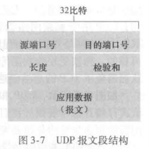
3. 端到端原则(end-end principle)：因为某种功能(在此时为差错检测)必须基于端到端实现:“与在较高级别提供这些功能的代价相比，在较低级别上设置的功能可能是冗余的或几乎没有价值的。”

## 3.4. 可靠数据传输原理

1. 解决出错和丢包问题：差错检测、接收反馈(ACK/NACK)、ARQ自动重传、定时重传、分组序号（区分新分组和重传分组，简单停等协议需1bit）、滑动窗口。

2. 简单的停等协议会带来较低的发送方利用率，发送方需要等待接收到ACK后才能进行下一个数据包的发送；流水线可靠数据传输协议：允许发送方在接收到ACK之前继续发送后续分组，但：
   - 必须增加序号范围，因为每个输送中的分组(不计算重传的)必须有一个唯一的序号，而且也许有多个在输送中的未确认报文；
   - 协议的发送方和接收方两端也许不得不缓存多个分组。发送方最低限度应当能缓冲那些已发送但没有确认的分组。如下面讨论的那样,接收方或许也需要缓存那些已正确接收的分组；
   - 所需序号范围和对缓冲的要求取决于数据传输协议如何处理丢失、损坏及延时过大的分组。
   - 解决流水线的差错恢复有两种基本方法是：回退N步(Co-Back-N, GBN)和选择重传(Selective Repeat, SR)。

3. 回退N步(滑动窗口协议)：窗口内为已被发送但未被确认的分组序号和允许发送的分组的序号，累计确认，相当于接收窗口大小为1
4. 选择重传：发送窗口、接收窗口

## 3.5. 面向连接的传输：TCP

1. TCP连接：全双工、点对点。在TCP规范[RFC793」中没提及TCP应何时实际发送缓存里的数据，只是描述为“TCP应该在它方便的时候以报文段的形式发送数据”。

2. TCP的MSS（最大报文段长度）受限于链路层的MTU（最大传输单元），TCP/IP头部40字节，以太网和PPP链路层协议都具有1500字节的MTU，因此TCP的MSS的典型值为1460字节。

3. TCP报文段格式：
   - 16比特的源端口号和16比特的目的端口号；
   - 32比特的序号字段和32比特的确认号字段，这些字段被TCP发送方和接收方用来实现可靠数据传输服务；
   - 16比特的接收窗口字段，该字段用于流量控制；
   - 4比特的首部长度字段，该字段指示了以32比特的字为单位的TCP首部长度。由于TCP选项字段的原因,TCP首部的长度是可变的。(通常，选项字段为空，所以TCP首部的典型长度是20字节)；
   - 可选与变长的选项字段，该字段用于发送方与接收方协商最大报文段长度(MSS)时，或在高速网络环境下用作窗口调节因子时使用；
   - 6比特的标志字段：
     - ACK比特用于指示确认字段中的值是有效的，即该报文段包括一个对已被成功接收报文段的确认。
     - RST、SYN和FIN比特用于连接建立和拆除；
     - CWR和ECE比特在明确拥塞通告中使用；
     - 当PSH比特被置位时，就指示接收方应立即将数据交给上层；
     - URG比特用来指示报文段里存在着被发送端的上层实体置为“紧急”的数据。
   - 紧急数据的最后一个字节由16比特的紧急数据指针字段指出。当紧急数据存在并给出指向紧急数据尾指针的时候，TCP必须通知接收端的上层实体。
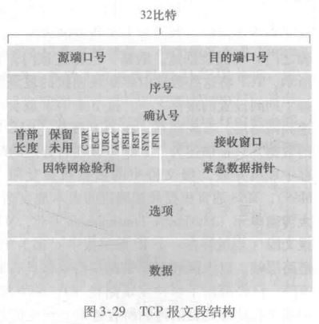

4. TCP的序号和确认号：
   - TCP把数据看成一个无结构的、有序的字节流；
   - TCP报文段的序号是该报文段首字节的字节流编号；
   - TCP报文段的确认号是发送方期望从通信对端接收到的下一字节的序号；
   - TCP只确认接收字节流中至第一个丢失字节为止的字节，所以TCP被称为提供累积确认；
   - TCP连接的双方均可随机地选择初始序号。这样做可以减少将那些仍在网络中存在的来自两台主机之间先前已终止的连接的报文段，误认为是后来这两台主机之间新建连接所产生的有效报文段的可能性（它碰巧与旧连接使用了相同的端口号）。

5. 在可靠数据传输时，假定每一个已发送但未被确认的报文段都与一个定时器相关联，这在概念上是最简单的。虽然这在理论上很好，但定时器的管理却需要相当大的开销。因此，推荐的定时器管理过程[RFC6298]仅使用单一的重传定时器，即使有多个已发送但还未被确认的报文段。

6. 超时间隔加倍与快速重传（冗余ACK，TCP不使用NACK）。

7. 流量控制：TCP为它的应用程序提供了流量控制服务以消除发送方使接收方缓存溢出的可能性。流量控制因此是一个速度匹配服务，即发送方的发送速率与接收方应用程序的读取速率相匹配。TCP通过让发送方维护一个称为接收窗口的变量来提供流量控制。当主机B的接收窗口为0时，主机A继续发送只有一个字节数据的报文段。这些报文段将会被接收方确认。最终缓存将开始清空，并且确认报文里将包含一个非0的接收窗口大小。

8. TCP建立连接的三次“握手”：
   - 客户端TCP向服务器端TCP发送一个`SYN=1, seq=x`的不包含应用层数据的报文段，请求建立连接；
   - 服务器端TCP收到`SYN=1`报文段，为该TCP连接分配TCP缓存和变量，并向客户端TCP发送`SYN=1, ACK=1, seq=y, ack=x+1`的允许连接报文段；
   - 客户端TCP在收到允许连接报文段后，给该连接分配缓存和变量，并向服务器端TCP发送`SYN=0, ACK=1, seq=x+1, ack=y+1`报文段，该报文段负载中可以携带应用层数据。
   - 服务器端TCP收到ACK，代表已完成连接建立，可开始后续的数据传输服务。
   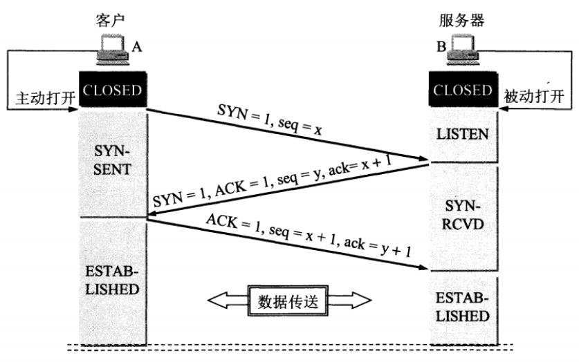

9. TCP释放连接的四次“挥手”：
   - 客户端TCP发送`FIN=1`的报文段给服务器端TCP，说明客户端不必发送数据给服务器了，请求释放从客户端到服务器的TCP连接；
   - 服务器接端TCP接收到客户端TCP发送的`FIN=1`报文段，并回复`ACK`给客户端，同意释放从客户端到服务器的连接；
   - 客户端TCP收到服务器端TCP回复的`ACK`，此时从客户端到服务器端的TCP连接已释放，但服务器端到客户端的TCP连接还未释放，并且客户端还可以接收数据；
   - 服务器端TCP继续发送之前没发完的数据给客户端TCP；
   - 服务器端TCP发送`FIN=1`报文段给客户端，说明服务器端发送完了数据，请求释放从服务器端到客户端的TCP连接，就算没收到客户端的回复，过段时间也会自动释放；
   - 客户端TCP收到服务器端TCP的`FIN=1`报文段，并回复`ACK`给服务器端TCP，同意释放从服务端到客户端的连接；
   - 服务端TCP收到客户端TCP的`ACK`后，释放从服务端到客户端的连接。
  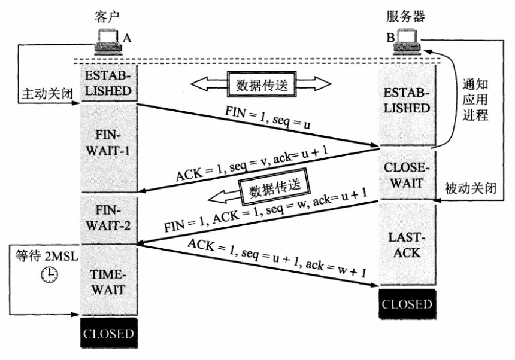

10. 为什么需要三次“握手”：
    - 因为通信双方都需要确认对方收到了自己发送的序列号，确认过程最少要进行三次通信。

11. 为什么需要四次“挥手”：
    - 因为TCP是全双工模式，客户端请求关闭连接后，客户端向服务端的连接关闭（一二次挥手），服务端继续传输之前没传完的数据给客户端（数据传输），服务端向客户端的连接关闭（三四次挥手）。所以TCP释放连接时服务器的ACK和FIN是分开发送的（中间隔着数据传输），而TCP建立连接时服务器的ACK和SYN是一起发送的（第二次握手），所以TCP建立连接需要三次，而释放连接则需要四次。

12. 为什么TCP连接时可以ACK和SYN一起发送，而释放时则ACK和FIN分开发送呢？（ACK和FIN分开是指第二次和第三次挥手）
    - 因为客户端请求释放时，服务器可能还有数据需要传输给客户端，因此服务端要先响应客户端FIN请求（服务端发送ACK），然后数据传输，传输完成后，服务端再提出FIN请求（服务端发送FIN）；而连接时则没有中间的数据传输，因此连接时可以ACK和SYN一起发送。

13. 为什么客户端释放最后需要 TIME-WAIT 等待 2MSL 呢？
    - 为了保证客户端发送的最后一个ACK报文能够到达服务端。若未成功到达，则服务端超时重传FIN+ACK报文段，客户端再重传ACK，并重新计时。
    - 防止已失效的连接请求报文段出现在本连接中。TIME-WAIT持续2MSL可使本连接持续的时间内所产生的所有报文段都从网络中消失，这样可使下次连接中不会出现旧的连接报文段。

## 3.6. 拥塞控制原理

## 3.7. TCP拥塞控制

1. 概念：拥塞控制就是防止过多的数据注入到网络中，这样可以使网络中的路由器或链路不致过载。

2. 方法：
   - 慢启动：拥塞控制窗口初始值设定的较小；
   - 拥塞避免：拥塞控制窗口大小增长速度减缓；
   - 快重传：
   - 快恢复：

## 3.8. TCP和UDP的区别

# 4. 网络层：数据平面

## 4.1. 网络层概述

1. 网络层的作用即将分组从一台发送主机移动到一台接收主机。为此，需要使用两种重要的网络层功能：
   - 转发（数据平面）：当一个分组到达某路由器的一条输人链路时，该路由器必须将该分组移动到适当的输出链路；
   - 路由选择（控制平面）：当分组从发送方流向接收方时，网络层必须决定这些分组所采用的路由或路径。计算这些路径的算法被称为路由选择算法。

2. 网络服务模型：定义了分组在发送与接收端系统之间的端到端运输特性
   - 确保交付
   - 具有时延上界的确保交付
   - 有序分组交付
   - 确保最小带宽
   - 安全性

3. TCP/IP的网络层提供**尽力而为服务**。

## 4.2. 路由器工作原理

1. 路由器体系结构（路由器的输入端口、输出端口和交换结构几乎总是用硬件实现,）
   - 输入端口
   - 交换结构
   - 输出端口
   - 路由选择处理器

    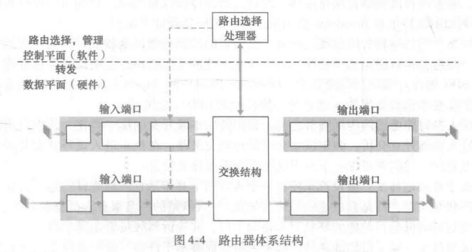

## 4.3. 网际协议：IPv4、寻址、IPv6

1. IPv4数据报格式：
   - 版本(号)：4比特。规定了IP协议版本；
   - 首部长度：4比特，单位为？。IPv4数据报可包含一些可变数量的选项(这些选项包括在IPv4数据报首部中)。大多数IP数据报不包含选项，所以一般的IP数据报具有20字节的首部；
   - 服务类型（TOS），8比特，区分不同类型的IP数据报（时延、吞吐量、可靠性）；
   - 数据报长度，16比特，单位为字节。这是IP数据报的总长度(首部加上数据)，数据报很少有超过1500字节的，该长度使得IP数据报能容纳最大长度以太网帧的载荷字段；
   - 标识（16比特）、标志（3比特）、片偏移（13比特）。这三个字段与IP分片有关，IPv6不允许在路由器上对分组分片；
   - 寿命（TTL），8比特。用来确保数据报不会永远(如由于长时间的路由选择环路)在网络中循环。每当一台路由器处理数据报时，该字段的值减1。若TTL字段减为0，则该数据报必须丢弃；
   - 上层协议，8比特；
   - 首部检验和，16比特。在每台路由器上必须重新计算检验和并再次存放到原处，因为TTL字段以及可能的选项字段会改变。此时，一个经常问的问题是：为什么TCP/IP在运输层与网络层都执行差错检测?
     - 首先，在IP层只对IP首部计算了检验和，而TCP/UDP检验和是对整个TCP/UDP报文段进行的。
     - 其次，TCP/UDP与IP不一定都必须属于同一个协议栈。原则上，TCP能够运行在一个不同的协议(如ATM)上，而IP能够携带不一定要传递给TCP/UDP的数据。
   - 源和目的IP地址，32比特。通常源主机通过DNS查找来决定目的地址,如在第2章中讨论的那样；
   - 选项，该字段允许IP首部被扩展；
   - 数据(有效载荷)。

    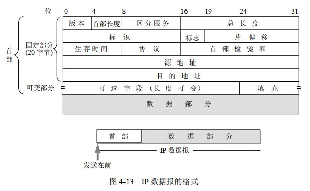

2. IPv4数据报分片：一个链路层帧能承载的最大数据量叫作最大传送单元(Maximum Transmission Unit,MTU)。在发送方与目的地路径上的每段链路可能使用不同的链路层协议，且每种协议可能具有不同的MTU。
   - 当生成一个数据报时，发送主机通常将它发送的每个数据报的标识号加1；
   - 当某路由器需要对一个数据报分片时，形成的每个数据报(即片)具有初始数据报的源地址、目的地址与标识号；
   - 目的主机通过检查数据报的标识号以确定哪些数据报实际上是同一较大数据报的片；
   - 初始数据报的最后一个片的标志比特被设为0，而所有其他片的标志比特被设为1；
   - 为了让目的主机确定是否丢失了一个片(且能按正确的顺序重新组装片)，使用偏移字段指定该片应放在初始IP数据报的哪个位置。

3. 主机与物理链路之间的边界叫作接口(interface)。路由器与它的任意一条链路之间的边界也叫作接口，一台路由器因此有多个接口，每个接口有其链路。IP要求每台主机和路由器接口拥有自己的IP地址，因此，从技术上讲，一个IP地址与一个接口相关联，而不是与包括该接口的主机或路由器相关联。

4. IPv4编址：
   - 因特网的地址分配策略被称为无类别域间路由选择(Classless Interdomain Routing, CIDR)。CIDR将子网寻址的概念一般化了。当使用子网寻址时，32比特的IP地址被划分为两部分，并且也具有点分十进制数形式a.b.c.d/x，其中x指示了地址的第一部分中的比特数。
   - 分类编址：`IP 地址 ::= {<网络号>,<主机号>}`
   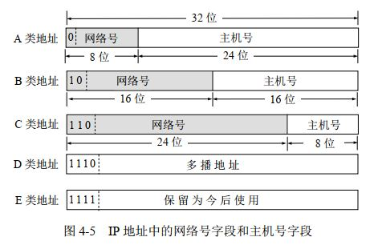
   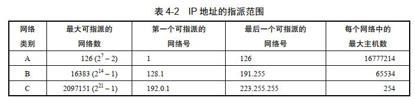
   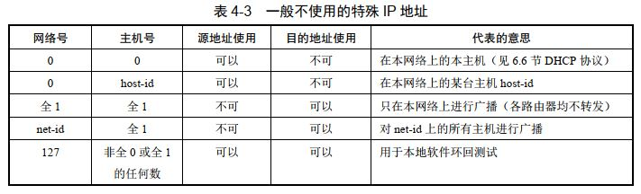

5. 动态主机配置协议(Dynamic Host Configuration, DHCP):获取主机地址
   - DHCP服务器发现：客户端在UDP分组中向端口67发送DHCP发现报文；
   - DHCP服务器提供；
   - DHCP请求；
   - DHCP ACK；

    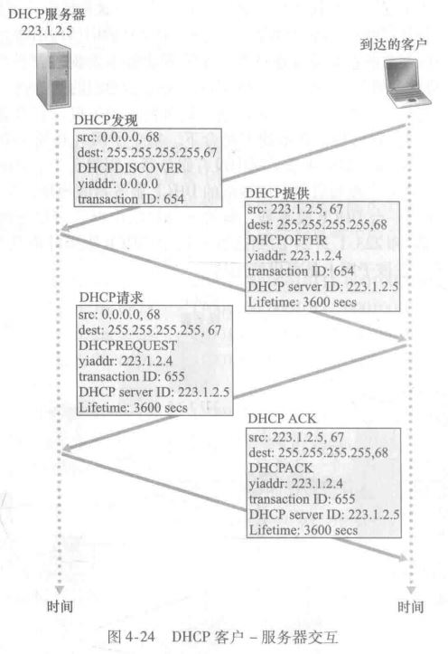

6. 网络地址转换(Network Address Translation, NAT)

7. IPv6数据报格式
   - 版本，4比特，用于标识IP版本号；
   - 流量类型，8比特，与IPv4中的TOS字段的含义相似；
   - 流标签，20比特，用于标识一条数据报的流，能够对一条流中的某些数据报给出优先权，或者它能够用来对来自某些应用(例如IP话音)的数据报给出更高的优先权，以优于来自其他应用(例如SMTP电子邮件)的数据报；
   - 有效载荷长度，16比特，给出了IPv6数据报中跟在定长的40字节数据报首部后面的字节数量；
   - 下一个首部。该字段标识数据报中的内容(数据字段)需要交付给哪个协议(如TCP或UDP)。该字段使用与IPv4首部中协议字段相同的值；
   - 跳限制，转发数据报的每台路由器将对该字段的内容减1，如果跳限制计数达到0，则该数据报将被丢弃；
   - 源地址和目的地址；
   - 数据，当数据报到达目的地时，该有效载荷就从IP数据报中移出，并交给在下一个首部字段中指定的协议处理。

    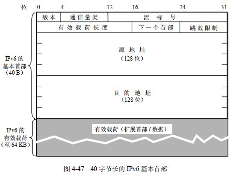

8. IPv4与IPv6的比较：
   - 扩大的地址容量。除了单播与多播地址以外，IP6还引人了一种称为任播地址(anycast address)的新型地址，这种地址可以使数据报交付给一组主机中的任意一个；
   - 简化高效的40字节首部；
   - 流标签；
   - 分片/重新组装。IPv6不允许在中间路由器上进行分片与重新组装。这种操作只能在源与目的地执行。如果路由器收到的Pv6数据报因太大而不能转发到出链路上的话，则路由器只需丢掉该数据报，并向发送方发回一个“分组太大”的ICMP差错报文即可，于是发送方能够使用较小长度的IP数据报重发数据；
   - 首部检验和。因为因特网层中的运输层(如TCP与UDP)和数据链路层(如以太网)协议执行了检验操作，IP设计者大概觉得在网络层中具有该项功能实属多余，所以将其去除。再次强调的是,快速处理IP分组是关注的重点。在IPv4中，由于IPv4首部中包含有一个TTL字段，所以在每台路由器上都需要重新计算IPv4首部检验和，这也是一项耗时的操作。
   - 选项。选项字段不再是标准IP首部的一部分。

## 4.4. 通用转发和SDN

# 5. 网络层：控制平面

## 5.1. 概述

1. 路由选择方法：
   - 每路由器控制；
   - 逻辑集中式控制：SDN；

## 5.2. 路由选择算法

1. 集中式路由选择算法，具有所有节点的连通性和所有链路开销的完整信息，一般称为链路状态(Link State, LS)算法；分散式路由选择算法，路由器以迭代，分布式的方式计算出最低开销路径。例：距离矢量算法。

2. 链路状态路由算法

3. 距离矢量路由算法

## 5.3. 因特网中自治系统内部的路由选择：OSPF

## 5.4. ISP之间的路由选择：BGP

## 5.5. SDN控制平面

## 5.6. ICMP：因特网控制报文协议

## 5.7. 网络管理和SNMP

# 6. 链路层和局域网
